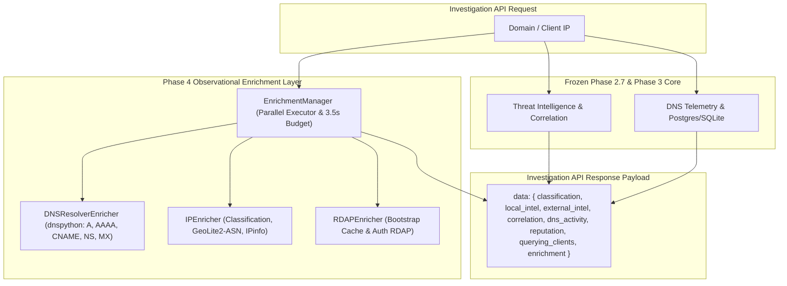

# Phase 4 — Domain & Client Enrichment Architecture

## 1. Architectural Philosophy & Boundaries

Phase 4 builds a minimal, production-sensible **observational enrichment layer** on top of the frozen Phase 2.7 Threat Intelligence core and frozen Phase 3 Investigation engine.

### Non-Negotiable Boundary: Observational Only
Enrichment data is strictly **observational** and is **never used as a scoring input** or verdict driver for threat detection:
- `ASN = AS12345`, `Country = Russia`, or `Registrar = XYZ` must **not** alter or inflate threat scores.
- Threat scoring remains the exclusive domain of the Phase 2.7 `WeightedScorer` and `CorrelationEngine` based on authoritative TI sources (Tranco, URLhaus, VirusTotal, AlienVault OTX).

---

## 2. Component Structure

The enrichment package is located under `backend/enrichment/`:

| Module | Responsibility | Providers & Provenance |
| :--- | :--- | :--- |
| `models.py` | Pydantic data transfer objects (`DNSResolutionResult`, `MXRecord`, `IPGeoResult`, `IPNetworkResult`, `IPEnrichmentItem`, `DomainRegistrationResult`, `DomainEnrichmentResult`, `ClientIPEnrichmentResult`). | Typed schemas, enums, ISO 8601 formatting. |
| `dns.py` | Resolves full DNS records (A, AAAA, CNAME, NS, structured MX) using `dnspython`. | `provider: "DNS Resolver"`, `provenance: "REAL"`, `freshness: "LIVE_LOOKUP"`. |
| `ip.py` | Classifies IP addresses (`PUBLIC`, `PRIVATE`, etc.), queries local `GeoLite2-ASN.mmdb`, queries live `IPinfo` HTTP API with explicit field mappings and RFC 1918 private IP guard. | `GeoLite2-ASN` (`LOCAL`), `IPinfo` (`REAL`), Private IPs (`COMPUTED`). |
| `rdap.py` | Queries authoritative RDAP endpoints using in-process IANA TLD bootstrap caching. | `provider: "Authoritative RDAP"`, `provenance: "REAL"`, `freshness: "LIVE_LOOKUP"`. |
| `manager.py` | High-level orchestrator managing bounded `ThreadPoolExecutor`, monotonic 3.5s deadline budget, and overall status aggregation. | `status: "AVAILABLE" \| "PARTIAL" \| "NO_DATA" \| "PROVIDER_FAILURE"`. |

---

## 3. Parallel Execution & Timeout Budgeting

To ensure the endpoint never hangs under slow upstream registries or network latency:
- **Monotonic Deadline:** `deadline = time.monotonic() + 3.5` seconds.
- **Component Timeouts:**
  - DNS resolution: 2.0s
  - IPinfo Geolocation: 2.0s
  - Authoritative RDAP: 3.0s
- **Concurrent Workers:** A dedicated `ThreadPoolExecutor(max_workers=8)` executes DNS, IP, and RDAP queries in parallel. Any worker exceeding the remaining time budget returns `PROVIDER_FAILURE` gracefully without crashing the overall response.

---

## 4. Status Aggregation Semantics

Each component and the top-level enrichment object report explicit, honest statuses:

| Status | Meaning | Top-Level Behavior |
| :--- | :--- | :--- |
| `AVAILABLE` | Lookup succeeded and produced meaningful data. Normal domains without MX/AAAA are considered `AVAILABLE` for DNS (absence of MX is not an error). | Contributes to `AVAILABLE` or `PARTIAL`. |
| `PARTIAL` | Some components succeeded (e.g. DNS available) while others failed or were unconfigured. | Top-level status becomes `PARTIAL`. |
| `NO_DATA` | Domain/IP was queried successfully but record does not exist (e.g. NXDOMAIN, RDAP 404). | Succeeded query with no records. |
| `NOT_CONFIGURED` | Required credentials missing (e.g. `IPINFO_TOKEN` not set). | Component marked `NOT_CONFIGURED`, `freshness: "NOT_APPLICABLE"`. |
| `NOT_APPLICABLE` | Non-routable IP (RFC 1918, Loopback). External lookup safely suppressed. | Component marked `NOT_APPLICABLE`, `provenance: "COMPUTED"`. |
| `PROVIDER_FAILURE` | Network timeout, socket error, HTTP 429/5xx, or unexpected registry failure. | Never converted to clean. |
