# DNS Threat Detection System — Classification Architecture Diagrams
> **Visual Reference Document**  
> Formatted for live preview using code editor Markdown Preview extensions with Mermaid support.

---

## Quick Navigation

1. [Diagram 1: Complete Zoomed-Out Architecture](#1-complete-zoomed-out-architecture)
2. [Diagram 2: Classification Engine Internal Logic](#2-classification-engine-internal-logic)
3. [Diagram 3: Local & Online Threat Intelligence Architecture](#3-local--online-threat-intelligence-architecture)
4. [Diagram 4: Domain Hierarchy & Scope Routing (FQDN vs Apex vs TLD)](#4-domain-hierarchy--scope-routing-fqdn-vs-apex-vs-tld)
5. [Diagram 5: Four Canonical Verdicts Lifecycle & Data Loss](#5-four-canonical-verdicts-lifecycle--data-loss)
6. [Diagram 6: Unknown Domain & External TI Sequence Diagram](#6-unknown-domain--external-ti-sequence-diagram)
7. [Diagram 7: Relational Database Architecture (PostgreSQL & SQLite)](#7-relational-database-architecture-postgresql--sqlite)
8. [Diagram 8: Incremental Aggregator Read-Model Architecture](#8-incremental-aggregator-read-model-architecture)
9. [Diagram 9: FastAPI Backend Route & Database Dispatch](#9-fastapi-backend-route--database-dispatch)
10. [Diagram 10: Next.js Frontend Component & Badge Normalization](#10-nextjs-frontend-component--badge-normalization)
11. [Diagram 11: End-to-End Traces for 8 Golden Domain Cases](#11-end-to-end-traces-for-8-golden-domain-cases)

---

## 1. Complete Zoomed-Out Architecture

This top-level diagram traces a DNS query from wire ingress through parsing, classification, multi-database persistence, asynchronous intelligence enrichment, dual read-model aggregation, the FastAPI tier, and the Next.js frontend.

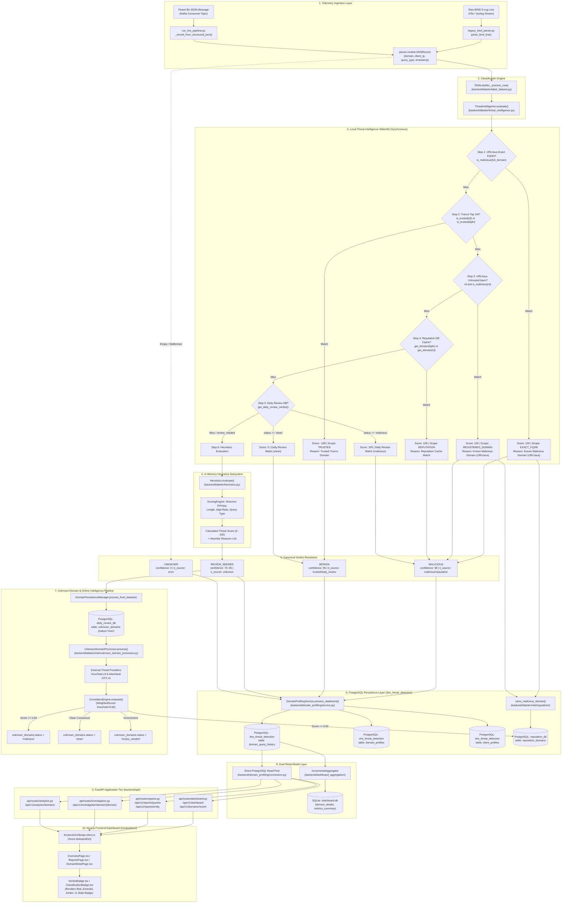

---

## 2. Classification Engine Internal Logic

Zoomed-in technical breakdown of `DNSLabeller._process_row()` showing exact inputs, branch conditions, scoring, and verdict resolution.

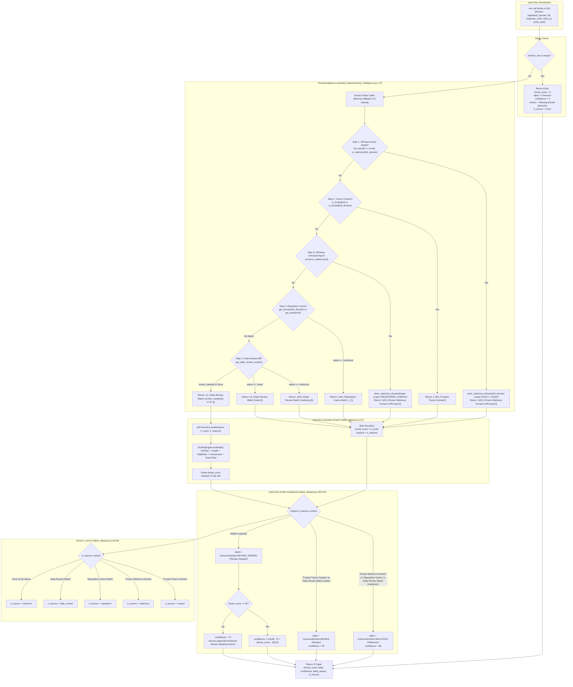

---

## 3. Local & Online Threat Intelligence Architecture

This diagram maps every threat intelligence source, database, updater, manager, and external provider.

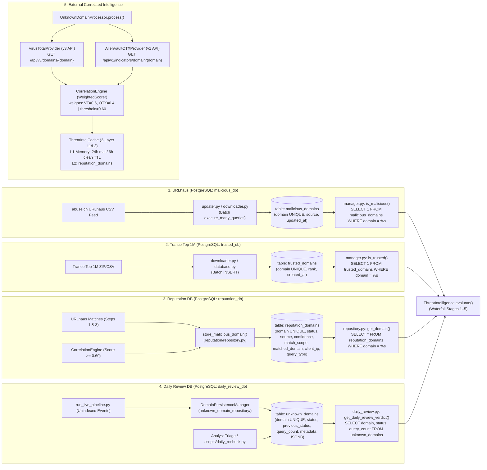

---

## 4. Domain Hierarchy & Scope Routing (FQDN vs Apex vs TLD)

How the system decomposes a domain and routes components to different intelligence databases.

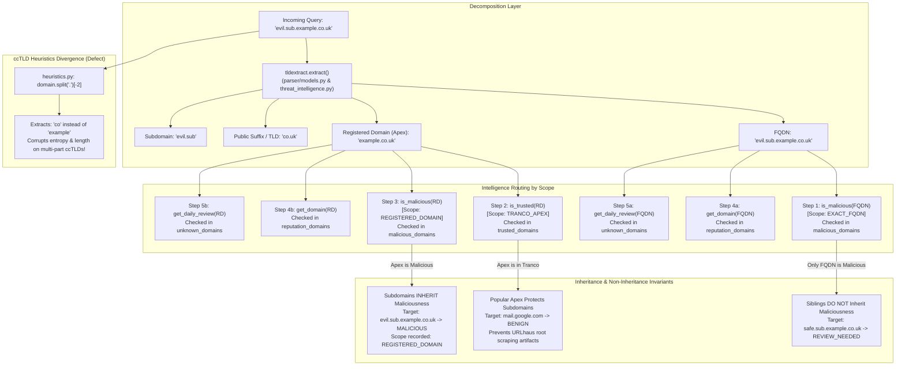

---

## 5. Four Canonical Verdicts Lifecycle & Data Loss

Tracing how the four statuses are stored, rolled up, aggregated, served, and displayed—highlighting where data loss occurs.

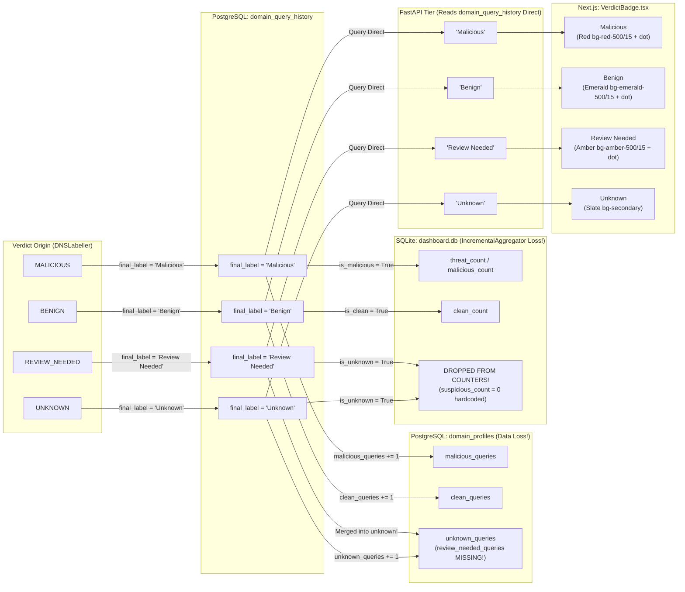

---

## 6. Unknown Domain & External TI Sequence Diagram

The exact asynchronous lifecycle of an unindexed domain when processed by VirusTotal, AlienVault OTX, and the `CorrelationEngine`.

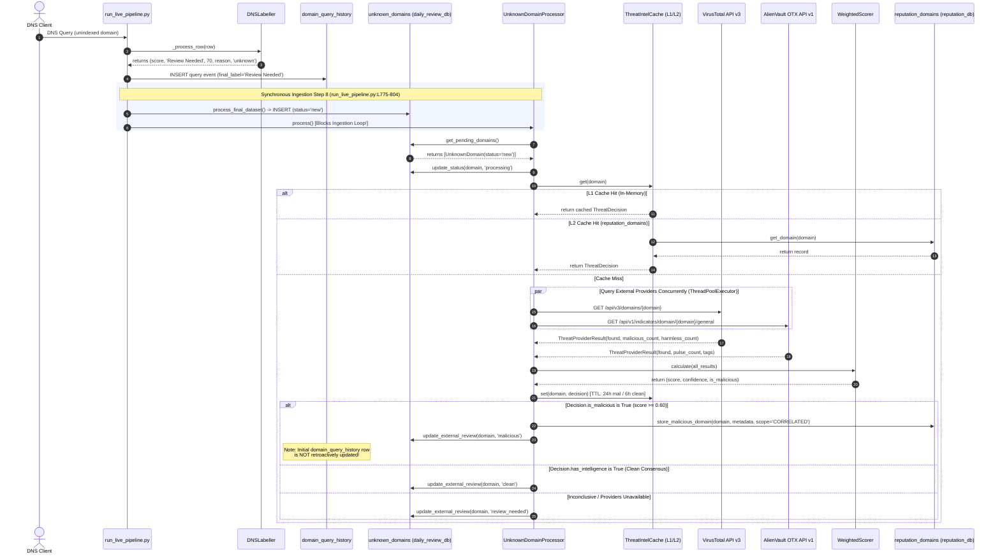

---

## 7. Relational Database Architecture (PostgreSQL & SQLite)

Entity relationship diagram mapping all six active databases and tables across the system.

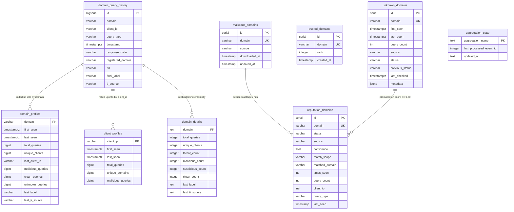

---

## 8. Incremental Aggregator Read-Model Architecture

Detailing how `IncrementalAggregator` processes events from PostgreSQL and writes to SQLite `dashboard.db`.

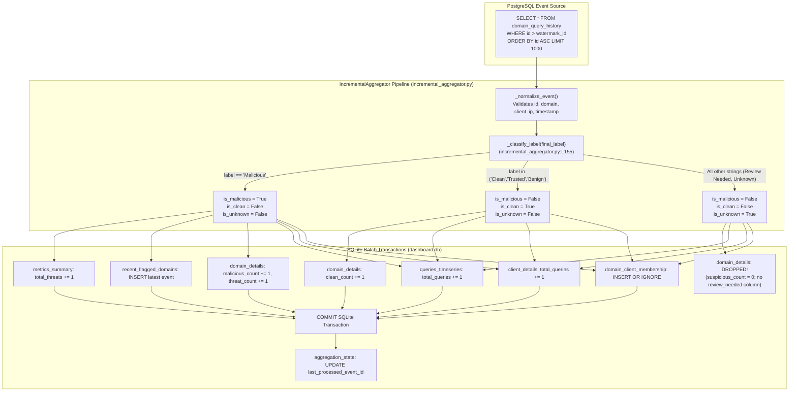

---

## 9. FastAPI Backend Route & Database Dispatch

Mapping each API endpoint directly to the underlying database connection and SQL queries.

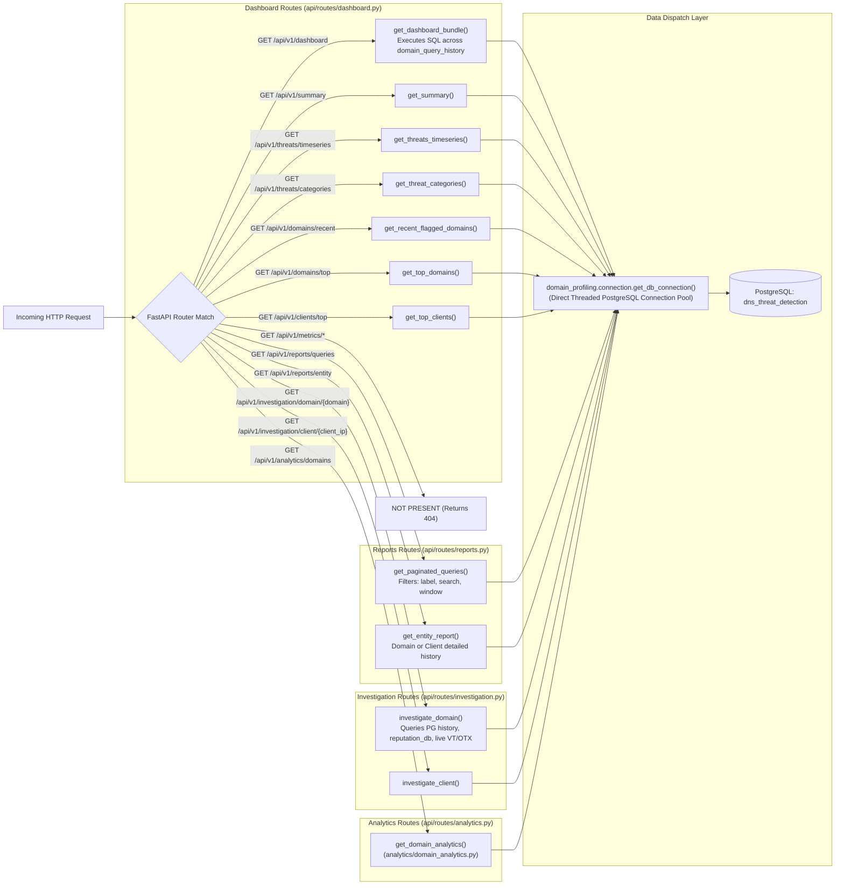

---

## 10. Next.js Frontend Component & Badge Normalization

Tracing frontend data flow from API responses through Axios deduplication to UI views and badges.

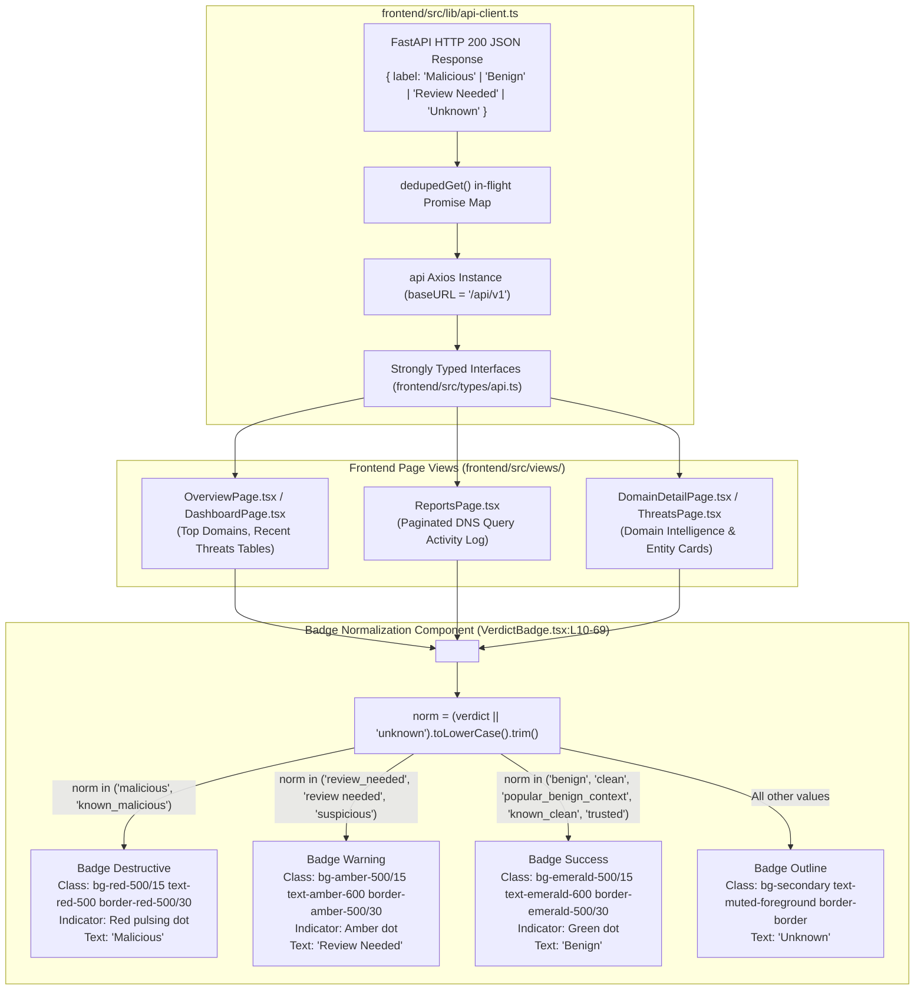

---

## 11. End-to-End Traces for 8 Golden Domain Cases

Comparing how eight test domains navigate the system from raw telemetry to the final UI badge.

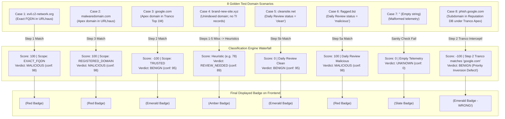
