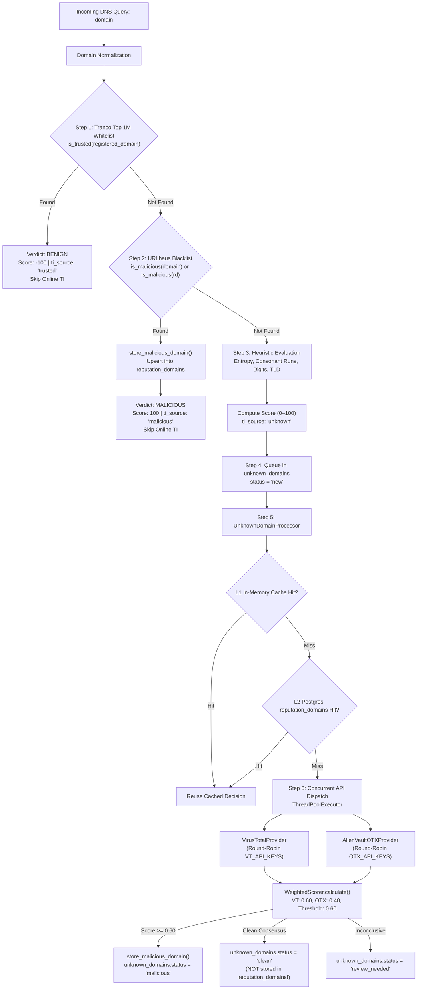

# DNSNetra — Full Repository Engineering Audit for MVP Preparation

**Audit Date:** September 2026  
**Auditor:** Antigravity AI Senior Systems & Security Architecture Specialist  
**Target Repository:** `DNSNetra` (`/Users/akshit/Developer/DNSNetra`)  
**Comparative Reference:** `dns-min` (`/Users/akshit/Developer/dns`)  
**Audit Scope:** Read-Only Static Code Analysis, Architecture Invariant Trace, Database & Pipeline Verification  
**Strict Directives Observed:** Zero code modifications; zero dependency installations; zero database migrations; strict separation of verified facts from recommendations.

---

## Executive Overview of the Audit

DNSNetra is a foundational DNS telemetry ingestion and threat detection backend. It contains working components for offline dataset labeling, multi-provider threat intelligence correlation (VirusTotal and AlienVault OTX), local threat intelligence databases (SQLite-backed Tranco whitelist with ~1M records and URLhaus blacklist with ~19.3K records), high-throughput feature extraction (55 lexical, DNS, and behavioral features), and PostgreSQL persistence layers for client profiling, domain profiling, domain history, and unknown domain queuing.

However, DNSNetra in its current state is **an incomplete streaming/batch pipeline that lacks an application API layer, an aggregation layer, a unified data model, and an operational frontend**. Furthermore, several critical components suffer from path brittleness, duplicated/orphaned databases, unhandled blocking synchronous network I/O in the stream consumer, missing modules (`bind_parser`, `live_log_reader`), and significant security exposures (plaintext production API keys and database credentials committed to version control).

The companion project `dns-min` (`/Users/akshit/Developer/dns`) represents a later evolutionary stage that solved several operational, read-model, API, and frontend challenges. This audit thoroughly maps both codebases to establish exactly what to **KEEP**, what to **MODIFY**, what to **ADD**, and what to **IGNORE** for a hardened, production-ready MVP.

---

# PART 1 — Repository Structure

### Complete Repository Map

```text
DNSNetra/
├── .env                                # [EXISTING, NEEDS CHANGE] Global PostgreSQL configuration & credentials (committed password!)
├── api.env                             # [EXISTING, NEEDS CHANGE] Live external Threat Intel API keys (committed VT/OTX keys!)
├── fluent-bit.conf                     # [EXISTING, NEEDS CHANGE] Fluent Bit daemon config (hardcoded foreign path: /home/rohan/...)
├── parsers.conf                        # [EXISTING, WORKING] Fluent Bit regex parser definition for BIND 9 named query logs
├── requirements.txt                    # [EXISTING, NEEDS CHANGE] Python package requirements (lacks web framework & aggregation tools)
├── run command.txt                     # [EXISTING, INFORMATIONAL] CLI execution cheatsheet for batch and live pipelines
├── run_pipeline.py                     # [EXISTING, PARTIALLY BROKEN] Batch execution pipeline orchestrator
├── run_live_pipeline.py                # [EXISTING, WORKING] Streaming Kafka-based live telemetry pipeline orchestrator
├── legacy_bind_parser.py               # [EXISTING, WORKING] Standalone regex parser for raw BIND 9 query log lines
├── domain_persistence.py               # [EXISTING, WORKING] Adapter bridging pipeline dataframes to unknown_domain_repository
├── live_dataset.csv                    # [EXISTING, GENERATED] CSV dump of raw parsed DNS events from live testing
├── live_features.csv                   # [EXISTING, GENERATED] CSV dump of extracted feature matrices from live testing
│
├── bind converter/                     # [EXISTING, PARTIALLY BROKEN] BIND log conversion & CSV formatting module
│   ├── config.py                       # Configuration dataclass for dataset generator
│   ├── csv_writer.py                   # DNSDatasetCSVWriter (formats DNSRecord into 36-column canonical dataset CSV)
│   ├── dataset_generator.py            # Batch generator (FAILS: imports missing bind_parser & live_log_reader)
│   ├── event_id.py                     # SHA-256 deterministic UUID event identifier generator
│   ├── invalid_logs.csv                # Quarantine CSV log for unparseable input lines
│   ├── logger.py                       # Logger setup for bind converter
│   ├── parser_statistics.py            # Runtime parsing metrics tracker (success, malformed, skipped counts)
│   └── timestamp_utils.py              # BIND/Syslog timestamp parsing and normalization utilities
│
├── client_profiling/                   # [EXISTING, WORKING] PostgreSQL client tracking & history module
│   ├── __init__.py                     # Package exports: initialize_pool, close_pool, process_query
│   ├── config.py                       # Database connection configuration from environment
│   ├── db.py                           # psycopg connection pool lifecycle manager
│   ├── schema.py                       # DDL schema for client_profiles & client_history tables
│   ├── manager.py                      # Core query processing logic (UPSERT client_profiles & client_history)
│   └── cleanup.py                      # Data retention & purge utility for historical client logs
│
├── data/                               # [EXISTING, WORKING] Authoritative local threat intelligence data directory
│   ├── malicious.lock                  # File lock for atomic updates to malicious_domains.db
│   └── malicious_domains.db            # [WORKING] SQLite database: 19,304 URLhaus malicious domains + metadata table
│
├── database/                           # [EXISTING, INCOMPLETE] Standalone SQL schema definitions
│   └── schema.sql                      # SQL DDL for client_profiles and client_history (omits other 5 tables!)
│
├── domain_profiling/                   # [EXISTING, WORKING] Domain behavioral and query history profiling module
│   ├── __init__.py                     # Package export marker
│   ├── config.py                       # PostgreSQL connection parameters for domain profiler
│   ├── connection.py                   # Thread-safe psycopg2 connection pool management
│   ├── schema.py                       # DDL schema: domain_profiles and domain_query_history tables + 6 indexes
│   ├── repository.py                   # Bulk SQL execution repository (execute_values, batch upserts)
│   ├── service.py                      # DomainProfilingService high-level API for DataFrame processing
│   └── cleanup.py                      # Retention cleanup utility for aging domain query history
│
├── feature extraction/                 # [EXISTING, WORKING] Feature extraction & enrichment engine (Directory with space!)
│   ├── 02_FEATURE_EXTRACTION_MODULE_deep_dive.md # Documentation on feature extraction mathematical formulas
│   ├── feature_extractor.py            # Master FeatureExtractor class (calculates 55 features per query)
│   ├── main.py                         # Standalone demonstration CLI for feature extraction
│   ├── data/                           # Data directory for feature matrices
│   │   └── feature_matrix.csv          # Generated 55-column feature matrix sample
│   ├── enrichment/                     # Network & protocol enrichment subpackage
│   │   ├── __init__.py                 # Package marker
│   │   ├── enrichment_manager.py       # EnrichmentManager orchestrating DNS, WHOIS, ASN, GeoIP lookups
│   │   ├── dns_lookup.py               # Live DNS resolver (A, AAAA, MX, NS, SOA, TXT queries)
│   │   ├── whois_lookup.py             # Live WHOIS querying via python-whois library
│   │   ├── asn_lookup.py               # MaxMind GeoLite2-ASN.mmdb local database reader
│   │   ├── geoip_lookup.py             # MaxMind GeoLite2-City.mmdb local database reader
│   │   └── databases/                  # Local MMDB database repository
│   │       └── GeoLite2-ASN.mmdb       # [WORKING] MaxMind GeoLite2 ASN binary database (7.4 MB)
│   └── extractors/                     # Individual statistical feature calculation modules
│       ├── __init__.py                 # Package marker
│       ├── lexical.py                  # Domain lexical features (length, entropy, vowels, digits, char ratios)
│       ├── dns_features.py             # DNS protocol features (TTL variance, rcode, IP churn)
│       ├── infra_features.py           # Infrastructure features (ASN, registrar, geo-diversity)
│       ├── behavioural_features.py     # Temporal & frequency features (bursts, beaconing intervals, failed ratios)
│       └── whois.py                    # WHOIS age, expiration, and registrar tenure features
│
├── feature_extraction/                 # [EXISTING, REDUNDANT] Underscored shadow directory
│   └── live_features.csv               # CSV output artifact from run_live_pipeline.py run
│
├── labeler/                            # [EXISTING, WORKING] Threat intelligence & heuristic classification engine
│   ├── __init__.py                     # Package marker
│   ├── config.py                       # LabelingConfig dataclass (thresholds, weights, API keys, TTLs)
│   ├── heuristics.py                   # ScoringEngine & Heuristics rule-based scoring (entropy, consonant runs, etc.)
│   ├── logger.py                       # Labeller logging setup
│   ├── label_dataset.py                # DNSLabeller class (evaluates row -> threat_score, label, confidence, ti_source)
│   ├── threat_intelligence.py          # ThreatIntelligence offline evaluation facade (Tranco + URLhaus + rules)
│   ├── utils.py                        # Mathematical utilities: Shannon entropy, SLD/TLD extractors
│   ├── data/                           # [EXISTING, UNUSED] Redundant/empty data directory
│   │   └── malicious_domains.db        # [UNUSED, EMPTY] 24 KB empty SQLite database (0 records!)
│   └── intel/                          # Core Threat Intelligence subsystem
│       ├── __init__.py                 # Package marker exporting online ThreatIntelligence facade
│       ├── config.py                   # Trusted domain (Tranco) SQLite configuration (refresh intervals, URLs)
│       ├── database.py                 # Trusted domain SQLite management, WAL mode, normalization, and DDL
│       ├── downloader.py               # Tranco Top 1M ZIP downloader and archive extractor
│       ├── lock.py                     # Inter-process file lock for trusted database updates
│       ├── manager.py                  # Thread-local lookup connection manager for is_trusted()
│       ├── updater.py                  # Tranco automated monthly refresh worker
│       ├── threat_intelligence.py      # Online Threat Intelligence Facade (wraps CorrelationEngine)
│       ├── unknown_domain_processor.py # UnknownDomainProcessor (queries online TI for pending domains)
│       ├── trusted_domains.db          # [WORKING] SQLite database: 999,992 Tranco Top 1M domains
│       ├── trusted_domains.db-shm      # SQLite WAL shared memory sidecar
│       ├── trusted_domains.db-wal      # SQLite Write-Ahead Log sidecar
│       ├── cache/                      # Two-layer Threat Intelligence Cache
│       │   ├── __init__.py             # Package marker
│       │   └── cache.py                # ThreatIntelCache: Layer 1 (In-Memory) + Layer 2 (PostgreSQL reputation_domains)
│       ├── correlation/                # Multi-provider consensus & scoring engine
│       │   ├── __init__.py             # Package marker
│       │   ├── engine.py               # CorrelationEngine: concurrent thread pool provider dispatcher
│       │   ├── scoring.py              # WeightedScorer: normalized weight evaluation & malicious threshold check
│       │   ├── models.py               # ThreatDecision, ThreatProviderResult dataclasses
│       │   └── exceptions.py           # Correlation subsystem exceptions
│       ├── malicious/                  # URLhaus offline database module
│       │   ├── __init__.py             # Package marker exporting is_malicious()
│       │   ├── config.py               # Config for data/malicious_domains.db
│       │   ├── database.py             # SQLite connection management & DDL for malicious_domains table
│       │   ├── downloader.py           # URLhaus CSV download & parser worker
│       │   ├── lock.py                 # Inter-process file locking for malicious DB updates
│       │   ├── manager.py              # MaliciousDBManager (handles is_malicious lookup and auto-updates)
│       │   └── updater.py              # 24-hour periodic updater for URLhaus database
│       ├── providers/                  # External Online Threat Intelligence API Clients
│       │   ├── __init__.py             # Provider registry and factory: get_enabled_providers()
│       │   ├── base.py                 # BaseThreatProvider abstract base class with backoff retries
│       │   ├── key_manager.py          # APIKeyManager: round-robin multi-key pool with 429 cooldowns
│       │   ├── virustotal.py           # VirusTotal v3 REST API provider client
│       │   └── alienvault.py           # AlienVault OTX v1 indicators API provider client
│       └── reputation/                 # PostgreSQL Malicious Domain Reputation Cache
│           ├── __init__.py             # Package exports: store_malicious_domain, get_domain, initialize_database
│           ├── config.py               # Database connection parameters from environment
│           ├── connection.py           # psycopg2 connection pool manager for reputation DB
│           ├── schema.py               # DDL schema for reputation_domains table
│           ├── repository.py           # CRUD operations: store_malicious_domain, get_domain, update_domain
│           └── cleanup.py              # Stale reputation record pruning utility (default > 180 days)
│
├── logs/                               # Runtime log file storage
│   └── dns_labeller.log                # Production log from labeller executions
│
├── parsing logs/                       # [EXISTING, WORKING] DNS Log Ingestion & Validation Module (Directory with space!)
│   ├── 01_PARSING_MODULE_deep_dive.md  # Comprehensive technical manual on DNS parsing mechanics
│   ├── main.py                         # Standalone parser test runner
│   ├── report.json                     # Generated JSON execution report
│   ├── invalid_logs.csv                # Quarantine output for malformed log lines
│   ├── labelled_dns_dataset.csv        # Output dataset with labels applied
│   ├── normalized_dns_dataset.csv      # Intermediate normalized dataset
│   ├── logs/                           # Test log fixture directory
│   │   └── query.log                   # BIND 9 sample query log file
│   └── parser/                         # Core DNS Parsing Engine
│       ├── __init__.py                 # Package marker
│       ├── models.py                   # DNSRecord dataclass definition
│       ├── parser.py                   # DNSLogParser (multi-format CSV/JSON/Line batch parser)
│       └── validators.py               # Comprehensive field validators: IP, domain, query_type, rcode, TTL
│
├── parsing_logs/                       # [EXISTING, REDUNDANT] Underscored shadow directory
│   └── live_dataset.csv                # CSV output artifact from live pipeline
│
└── unknown_domain_repository/          # [EXISTING, WORKING] Isolated Unknown Domain Persistence Subsystem
    ├── pyproject.toml                  # Standalone package definition for unknown_domain_repository
    ├── README.md                       # Comprehensive subsystem architecture documentation
    ├── CHANGELOG.md                    # Subsystem version history
    ├── docs/                           # Architectural documentation
    │   ├── API_REFERENCE.md            # Detailed API documentation for UnknownDomainService
    │   ├── DATABASE_SCHEMA.md          # PostgreSQL database schema and indexing rationale
    │   ├── INTEGRATION_GUIDE.md        # Pipeline integration guide
    │   └── PERFORMANCE_TUNING.md       # PostgreSQL tuning guide for high-volume ingest
    ├── sql/                            # PostgreSQL migrations and DDL
    │   ├── schema.sql                  # Canonical schema for unknown_domains table, enums, and triggers
    │   └── migrations/                 # Migration scripts (001_initial_schema.sql, 002_performance_indexes.sql)
    ├── tests/                          # 10 comprehensive pytest test suites (unit, integration, concurrent, perf)
    └── unknown_domain_repository/      # Core package source
        ├── __init__.py                 # Public package interface
        ├── config.py                   # Environment configuration loader (UDR_* env vars)
        ├── constants.py                # DomainStatus and DomainSource enums
        ├── database.py                 # PostgreSQL connection pool and transaction manager
        ├── models.py                   # UnknownDomain, DomainFilter, ProcessingStats dataclasses
        ├── repository.py               # Low-level PostgreSQL CRUD and batch COPY/UPSERT queries
        ├── service.py                  # UnknownDomainService business logic and workflow coordinator
        ├── utils.py                    # Domain validation and sanitization utilities
        └── logger.py                   # Structured JSON logging configuration
```

---

# PART 2 — Application Architecture

### Actual Architecture of DNSNetra

Tracing the real execution path in DNSNetra reveals two distinct operational modes:
1. **Batch Mode (`run_pipeline.py`)**: Designed to read a BIND log file, generate an intermediate CSV, label the CSV with offline intelligence, persist unknown domains, parse the CSV into `DNSRecord`s, profile clients, enrich records via external lookups, and dump an extracted 55-feature matrix to CSV. *(Currently partially broken due to missing imports in `dataset_generator.py`).*
2. **Streaming Mode (`run_live_pipeline.py`)**: Reads pre-parsed JSON events from an Apache Kafka topic (`dns-logs`) emitted by Fluent Bit, deserializes them into `DNSRecord`s, deduplicates in-memory, writes to dataset CSV, labels synchronously, profiles the domain into PostgreSQL, processes unknown domains synchronously via online threat APIs, profiles the client into PostgreSQL, executes live WHOIS and DNS enrichment synchronously, extracts features, and appends them to a feature CSV.

```mermaid
flowchart TD
    subgraph INGESTION["1. Log Ingestion & Parsing"]
        FLUX["Fluent Bit (fluent-bit.conf)<br/>Tails /var/cache/bind/query.log"] -->|Regex Parsed JSON| KAFKA["Apache Kafka Topic: dns-logs"]
        KAFKA -->|JSON Consumer| LIVE_PIPE["run_live_pipeline.py<br/>_record_from_structured_json()"]
        RAW_FILE["Raw BIND 9 File"] -.->|Legacy Non-Kafka Path| LEGACY_PARSE["legacy_bind_parser.py<br/>parse_bind_line()"]
        LEGACY_PARSE -.-> REC_BUILD["Build DNSRecord"]
        LIVE_PIPE --> REC_BUILD
    end

    subgraph DEDUP_WRITE["2. Deduplication & Dataset Write"]
        REC_BUILD --> MEM_DEDUP{"_PipelineStats.is_duplicate()<br/>Memory Set seen"}
        MEM_DEDUP -- Duplicate --> DROP["Drop Event"]
        MEM_DEDUP -- New --> CSV_WRITE["DNSDatasetCSVWriter.write_event()<br/>Appends to live_dataset.csv"]
    end

    subgraph OFFLINE_TI["3. Synchronous Offline Labelling"]
        CSV_WRITE --> LABELLER["DNSLabeller._process_row()"]
        LABELLER --> TI_EVAL["ThreatIntelligence.evaluate()"]
        
        TI_EVAL --> CHK_TRUST{"is_trusted(registered_domain)?<br/>(SQLite: trusted_domains.db)"}
        CHK_TRUST -- Yes --> RES_TRUST["Score: -100 | Label: Benign<br/>ti_source: trusted"]
        
        CHK_TRUST -- No --> CHK_MAL{"is_malicious(domain)?<br/>(SQLite: data/malicious_domains.db)"}
        CHK_MAL -- Yes --> STORE_MAL["store_malicious_domain()<br/>(PG: reputation_domains)"]
        STORE_MAL --> RES_MAL["Score: 100 | Label: Malicious<br/>ti_source: malicious"]
        
        CHK_MAL -- No --> HEUR["Heuristics.evaluate()<br/>Entropy, Consonants, Digits, TLD"]
        HEUR --> RES_HEUR["Score: 0–100 | Label: Benign/Suspicious/Malicious<br/>ti_source: unknown"]
    end

    subgraph PROFILING_PERSIST["4. Domain Profiling & Persistence"]
        RES_TRUST & RES_MAL & RES_HEUR --> DOM_PROF["DomainProfilingService.process_dataframe()<br/>(PG: domain_profiles, domain_query_history)"]
        
        DOM_PROF --> TI_BRANCH{"ti_source Branching"}
        TI_BRANCH -- "malicious" --> SKIP_ONLINE_MAL["Already persisted to reputation_domains.<br/>Skip online TI."]
        TI_BRANCH -- "trusted" --> SKIP_ONLINE_TRU["Whitelist hit.<br/>Skip online TI."]
        TI_BRANCH -- "unknown" --> SYNC_ONLINE["UnknownDomainProcessor.process()"]
    end

    subgraph ONLINE_TI["5. Synchronous Online Threat Intelligence"]
        SYNC_ONLINE --> UDR_STORE["DomainPersistenceManager.process_final_dataset()<br/>(PG: unknown_domains status='new')"]
        UDR_STORE --> CORR_ENG["CorrelationEngine.evaluate()"]
        CORR_ENG --> CACHE_CHK{"ThreatIntelCache Hit?<br/>L1 Memory / L2 PG reputation_domains"}
        CACHE_CHK -- Hit --> CACHE_RES["Return Cached Decision"]
        CACHE_CHK -- Miss --> EXT_APIS["ThreadPoolExecutor Concurrent Queries:<br/>- VirusTotalProvider (VT v3)<br/>- AlienVaultOTXProvider (OTX v1)"]
        EXT_APIS --> SCORER["WeightedScorer.calculate()<br/>VT: 0.60 | OTX: 0.40"]
        SCORER -- "Score >= 0.60" --> MAL_ONLINE["store_malicious_domain()<br/>(PG: reputation_domains)<br/>unknown_domains.status = 'malicious'"]
        SCORER -- Clean --> CLN_ONLINE["unknown_domains.status = 'clean'"]
        SCORER -- Inconclusive --> REV_ONLINE["unknown_domains.status = 'review_needed'"]
    end

    subgraph CLIENT_ENRICH_FEAT["6. Client Profiling, Enrichment & Features"]
        MAL_ONLINE & CLN_ONLINE & REV_ONLINE & CACHE_RES & SKIP_ONLINE_MAL & SKIP_ONLINE_TRU --> CLI_PROF["client_profiling.process_query()<br/>(PG: client_profiles, client_history)"]
        CLI_PROF --> ENRICH["EnrichmentManager.enrich()<br/>- Live DNS Resolution (dnspython)<br/>- Live WHOIS Query (python-whois)<br/>- ASN Lookup (GeoLite2-ASN.mmdb)"]
        ENRICH --> FEAT_EXT["FeatureExtractor.extract()<br/>Extracts 55 Statistical Features"]
        FEAT_EXT --> FEAT_WRITE["IncrementalFeatureWriter<br/>Appends to live_features.csv"]
        FEAT_WRITE --> COMMIT_KAFKA["KafkaConsumer.commit()"]
    end
```



---

# PART 3 — DNS Processing Audit

### Ingestion & Formats
1. **Supported Formats**: 
   - **BIND 9 Query Log** (Native timestamp: `DD-Mon-YYYY HH:MM:SS.mmm` and Syslog timestamp: `Mon DD HH:MM:SS`).
   - **Fluent Bit Structured JSON**: Consumed via Kafka containing mapped fields (`client_ip`, `domain`, `query_type`, `@timestamp`, etc.).
   - **CSV/JSON Datasets**: Handled by `parsing logs/parser/parser.py`.
2. **Extraction Mechanics**:
   - **Client IP**: Extracted via regex `client\s+(?:@\S+\s+)?(?P<client_ip>[\d a-fA-F:.]+)#(?P<client_port>\d+)`.
   - **Domain**: Extracted via `query:\s+(?P<domain>\S+)`.
   - **Query Type**: Extracted and normalized to uppercase.
   - **Response Code**: Extracted via `_RE_RESPONSE` matching 11 RFC response codes (NOERROR, NXDOMAIN, SERVFAIL, REFUSED, etc.). Defaults to `NOERROR` if absent.
   - **Resolved IP & TTL**: Extracted optionally if answer logging is enabled in named.
3. **Flaws & Critical Edge Cases**:
   - **IPv6 Client Support**: `legacy_bind_parser.py` extracts IPv6 addresses, but `parsing logs/parser/validators.py` strictly rejects any non-IPv4 address because `validate_ip_address` enforces `IPV4_PATTERN = re.compile(r"^(\d{1,3})\.(\d{1,3})\.(\d{1,3})\.(\d{1,3})$")`. This crashes validation for any IPv6 client!
   - **Subdomain Component Extraction**: `bind converter/csv_writer.py` uses a naive string split on dots (`parts = domain.lower().rstrip('.').split('.')`) and assigns `registered_domain = '.'.join(parts[-2:])`. For multi-part ccTLDs like `co.uk` or `gov.in`, `evil.co.uk` erroneously yields `registered_domain = "co.uk"` and `subdomain = "evil"`, breaking downstream Tranco lookups!
   - **NXDOMAIN Handling**: Correctly identified and parsed; adds +10 to threat score in `ThreatIntelligence.evaluate()`.

---

# PART 4 — Domain Normalization Audit

### Normalization Mechanics Across Submodules
There are **three distinct, uncoordinated domain normalization implementations** in DNSNetra:

| Location | Implementation | Trailing Dot | IDN / Punycode | URL / Scheme Stripping | Port / Path Stripping |
| :--- | :--- | :--- | :--- | :--- | :--- |
| `labeler/intel/database.py` (Authoritative) | `normalize_domain(domain: str)` | Stripped (`strip(".")`) | **Supported** (`idna.encode/decode`) | **Supported** (`://`, `//`, `@`) | **Supported** (`/`, `?`, `#`, `:`) |
| `parsing logs/parser/validators.py` | `validate_domain(domain_str: str)` | **NOT stripped** | Logs warning on punycode | Rejected by regex | Rejected by regex |
| `bind converter/csv_writer.py` | `_extract_domain_components()` | Stripped (`rstrip(".")`) | **Ignored** (breaks on unicode) | Not handled | Not handled |

### Conflict & Vulnerability
If an incoming query has a trailing dot (e.g., `google.com.`), `validators.py` logs a warning and returns `google.com.`. When `csv_writer.py` processes it, it strips it, but when `validators.py` is invoked alone, trailing dots remain. 
**The implementation in `labeler/intel/database.py` is by far the most complete and RFC-compliant** and must become the authoritative normalizer across the entire codebase.

---

# PART 5 — Threat Intelligence Audit

### Source Inventory & Operational Metrics

| Source | Purpose | Storage & Location | Schema / Type | Lookup Method | Update Method | Caller | Failure Behavior |
| :--- | :--- | :--- | :--- | :--- | :--- | :--- | :--- |
| **Tranco Top 1M** | Trusted whitelist | SQLite: `labeler/intel/trusted_domains.db` | `trusted_domains (domain PK, rank, source, downloaded_at)` | `is_trusted()` (exact domain lookup) | Automated 30-day download from Tranco URL | `ThreatIntelligence.evaluate()` | Returns `False` (safe fallback) |
| **URLhaus Blacklist** | Known malware / botnet | SQLite: `data/malicious_domains.db` | `malicious_domains (domain PK, source, downloaded_at)` | `is_malicious()` (exact domain lookup) | Automated 24-hr download from Abuse.ch | `ThreatIntelligence.evaluate()` | Returns `False` (falls back to heuristics) |
| **Local Suspicious TLDs** | TLD risk scoring | Flat File: `labeler/intel/suspicious_tlds.txt` | Set of TLD strings | `in` set lookup | Static file | `ThreatIntelligence.evaluate()` | Ignored if file missing |
| **Reputation DB** | Malicious verdict cache | PostgreSQL: table `reputation_domains` | `reputation_domains (domain UNIQUE, status, source, confidence, client_ip, query_type...)` | `get_domain(domain)` | UPSERT on offline/online detection | `CorrelationEngine._cache` & `ThreatIntelligence` | Postgres error handled; logs warning |
| **VirusTotal v3** | Online external TI | External REST API | JSON attributes response (`last_analysis_stats`) | `VirusTotalProvider.lookup()` via HTTP GET | Live API call | `CorrelationEngine` via `UnknownDomainProcessor` | Marked `unavailable=True`, excluded from scoring |
| **AlienVault OTX** | Online external TI | External REST API | JSON indicator response (`pulse_info`) | `AlienVaultOTXProvider.lookup()` via HTTP GET | Live API call | `CorrelationEngine` via `UnknownDomainProcessor` | Marked `unavailable=True`, excluded from scoring |

---

# PART 6 — Classification Logic

### Current DNSNetra Flow vs Desired MVP Flow

```text
DESIRED MVP FLOW:
Domain ──► Normalize ──► Trusted DB (FOUND ──► CLEAN)
                            │
                       (NOT FOUND)
                            ▼
                    Malicious DB (FOUND ──► MALICIOUS)
                            │
                       (NOT FOUND)
                            ▼
                    Reputation DB Cache (FOUND ──► REUSE VERDICT)
                            │
                       (NOT FOUND)
                            ▼
                    Online TI (VirusTotal / OTX) ──► Classification ──► Store in Reputation DB
```

```text
ACTUAL DNSNetra FLOW:
Domain ──► Strip trailing dot (partial)
              ▼
       Tranco Whitelist (FOUND ──► Score: -100, Label: Benign, ti_source: trusted)
              │
         (NOT FOUND)
              ▼
       URLhaus Blacklist (FOUND ──► Score: 100, Label: Malicious, ti_source: malicious, 
              │                     UPSERT into reputation_domains)
         (NOT FOUND)
              ▼
       Legacy Files + Suspicious TLDs + Heuristic Scoring (Entropy, Digits, Length)
              ▼
       Threat Score Thresholds (>=100 Malicious, >=35 Suspicious, <35 Benign)
              ▼
      ti_source Check:
         ├── If 'malicious': Skip online TI
         ├── If 'trusted':   Skip online TI
         └── If 'unknown':   Insert into unknown_domains (status='new')
                                  ▼
                             UnknownDomainProcessor:
                             Online TI (VirusTotal + OTX) via CorrelationEngine
                                  ▼
                             If Malicious: UPSERT into reputation_domains & unknown_domains.status='malicious'
                             If Evidenced Clean: unknown_domains.status='clean'
                             If Inconclusive: unknown_domains.status='review_needed'
```

### Critical Discrepancies & Flaws
1. **Reputation DB Cache Bypass**: In the primary offline labeling path (`ThreatIntelligence.evaluate()`), `reputation_domains` is **never queried**. A domain previously confirmed malicious or clean by online TI is not checked upfront; it is re-evaluated by heuristics!
2. **Asymmetrical Reputation Persistence**: Only **malicious** domains are persisted into `reputation_domains`. Clean domains are marked `clean` in `unknown_domains` table, but never entered into `reputation_domains`. As a result, the system can never cache a clean verdict persistently across restarts.
3. **Heuristics Overwrite Risk**: In `label_dataset.py`, if a domain is neither Tranco nor URLhaus, it is assigned a label ("Benign", "Suspicious", "Malicious") based purely on Shannon entropy and character runs *before* online TI has even been queried!

---

# PART 7 — Malicious Domain Database Audit

### Database Verification Facts
1. **Authoritative Location**: `data/malicious_domains.db` (Size: 2,048,000 bytes).
2. **Record Count**: **19,304** active malicious domains.
3. **Metadata Verified**:
   - `last_update`: `2026-08-15 11:45:36`
   - `dataset_version`: `v1`
   - `source`: `urlhaus`
   - `record_count`: `19304`
4. **Schema**:
   ```sql
   CREATE TABLE malicious_domains (
       domain TEXT PRIMARY KEY,
       source TEXT NOT NULL DEFAULT 'urlhaus',
       downloaded_at TEXT
   );
   CREATE INDEX idx_domain ON malicious_domains(domain);
   CREATE TABLE metadata (key TEXT PRIMARY KEY, value TEXT);
   ```
5. **Orphaned Database**: `labeler/data/malicious_domains.db` (Size: 24,576 bytes) contains **0 records**. It is completely empty and unused.

---

# PART 8 — Threat Feed / List Audit

1. **URLhaus Feed**: Ingested from `https://urlhaus.abuse.ch/downloads/csv/` via `labeler/intel/malicious/updater.py`. The downloader parses CSV lines, extracts hostnames, normalizes domains, skips comments, and performs batch insertion into `malicious_domains.db.new` before atomic rename.
2. **Tranco Top 1M**: Ingested from `https://tranco-list.eu/top-1m.csv.zip` via `labeler/intel/downloader.py`. Extracts CSV from ZIP, reads `(rank, domain)`, normalizes domains, and commits to `trusted_domains.db`.
3. **Exclusion Gap**: The URLhaus updater does **not** cross-reference the Tranco whitelist during ingestion. If a compromised high-traffic domain (e.g. cloud storage or file sharing) appears on URLhaus, it is inserted into `malicious_domains.db`. While `ThreatIntelligence.evaluate()` checks Tranco first, feed-level exclusion is currently missing.

---

# PART 9 — Trusted / Whitelist Database Audit

1. **Database Location**: `labeler/intel/trusted_domains.db` (Size: ~45 MB with WAL sidecars).
2. **Record Count**: **999,992** domains.
3. **Matching Behavior**:
   - Query: `SELECT 1 FROM trusted_domains WHERE domain = ? LIMIT 1`.
   - Matching is **exact string match on normalized domain**.
   - `ThreatIntelligence.evaluate()` passes `registered_domain` to `is_trusted()`. Therefore, `mail.google.com` checks `google.com` and succeeds.
   - However, for ccTLDs (`co.uk`), naive extraction causes false negatives.
4. **Precedence**: Trusted domains are checked **before** malicious domains in `ThreatIntelligence.evaluate()`.

---

# PART 10 — Reputation Database Audit

### Comprehensive Architectural Findings

| Audit Question | DNSNetra Actual Implementation | MVP Specification Requirement |
| :--- | :--- | :--- |
| **What gets inserted?** | **Only malicious domains** (URLhaus hits + online TI malicious consensus). | All domains that passed through intelligence (clean, malicious, suspicious). |
| **When is it inserted?** | Synchronously when URLhaus matches, or asynchronously when Online TI flags malicious. | As soon as an authoritative or correlated verdict is established. |
| **Who inserts it?** | `store_malicious_domain()` called by `threat_intelligence.py` and `CorrelationEngine`. | Aggregator / Pipeline Persistence Service. |
| **Can clean domains enter?** | **NO.** Explicitly blocked by design in `run_live_pipeline.py:723`. | **YES.** Must store clean domains to prevent repeated API calls. |
| **Is it a cache?** | Acts as a write-heavy log and Layer-2 cache for malicious lookups only. | Authoritative queryable reputation cache for all statuses. |
| **How is it queried?** | Only queried by `CorrelationEngine._cache.get()` during online evaluation. | Queried upfront before invoking expensive external APIs or heuristics. |

**Verdict**: DNSNetra's `reputation_domains` table is currently a **Malicious Domain Event Log**, not a true bidirectional reputation cache.

---

# PART 11 — External API Audit

### Integrated Services
1. **VirusTotal v3**:
   - Endpoint: `https://www.virustotal.com/api/v3/domains/{domain}`
   - Authentication: Round-robin via `APIKeyManager` using `VT_API_KEYS` (4 keys configured in `api.env`).
   - Rate Limit Handling: On HTTP 429, key is placed on 60-second cooldown and next key is immediately tried.
   - Scoring Logic: Computes `malicious / total`. If `total == 0`, marks `unavailable=True`.
2. **AlienVault OTX v1**:
   - Endpoints: `/api/v1/indicators/domain/{domain}/general` and `/analysis`.
   - Authentication: Round-robin via `APIKeyManager` using `OTX_API_KEYS` (4 keys configured in `api.env`).
   - Rate Limit Handling: Same 60-second cooldown mechanics.
   - Scoring Logic: Flags malicious if `pulse_info.count > 0` or threat intelligence pulses exist.
3. **WHOIS & DNS Lookups**:
   - Performed via `python-whois` and `dnspython`.
   - **Severe Bottleneck**: Performed synchronously on single messages in `run_live_pipeline.py`.
4. **MaxMind GeoIP & ASN**:
   - `GeoLite2-ASN.mmdb` is local and fast (~0.05ms per lookup).
   - `GeoLite2-City.mmdb` is configured but currently disabled.

---

# PART 12 — Aggregation Audit

### Current Status: **NON-EXISTENT in DNSNetra**
- DNSNetra has **no aggregation service, no time-windowing, and no precomputed metrics tables**.
- Query counts, unique clients, and top domains must currently be calculated via full-table scans over millions of rows in `domain_query_history` or `client_history`.
- **Contrast with `dns-min`**: `dns-min` implemented `IncrementalAggregator` (`backend/dashboard_aggregation/`) which tracks a watermark pointer on `domain_query_history.id` and writes pre-aggregated statistics into a local SQLite read-model (`dashboard.db`). This is a **mandatory ADD** for the MVP.

---

# PART 13 — Kafka / Event Pipeline Audit

### Implementation Details
- **Consumer**: Uses `kafka-python` (`KafkaConsumer`).
- **Topic**: `dns-logs` (default bootstrap: `localhost:9092`).
- **Group ID**: `dns_threat_pipeline`.
- **Deserializer**: JSON deserializer (`json.loads`).
- **Offset Commit**: Synchronous commit per message (`consumer.commit()`).
- **Missing Elements**:
  - No batch fetching (`consumer.poll()` with batch size).
  - No Dead-Letter Queue (DLQ) for corrupted messages.
  - No asynchronous offset commit.

---

# PART 14 — Fluent Bit Audit

1. **Configuration**: `fluent-bit.conf` tails `/var/cache/bind/query.log` using the `dns_bind_parser` regex defined in `parsers.conf`. Outputs JSON records to Kafka topic `dns-logs`.
2. **Defect**: Line 6 contains a hardcoded developer path:
   `Parsers_File /home/rohan/Desktop/project(fluentbit-kafka)/parsers.conf`
   This immediately fails on any deployment machine where `/home/rohan` does not exist!

---

# PART 15 — Persistence / Database Audit

### Inventory of All Databases

```text
1. SQLite: data/malicious_domains.db
   └── Tables: malicious_domains (19,304 rows), metadata
2. SQLite: labeler/intel/trusted_domains.db
   └── Tables: trusted_domains (999,992 rows), metadata
3. SQLite: labeler/data/malicious_domains.db (ORPHANED, 0 rows)
4. PostgreSQL: dns_threat_detection (configured in .env)
   ├── Table: client_profiles (client_ip PK, first_seen, last_seen)
   ├── Table: client_history (id BIGSERIAL, client_ip, domain, visit_count, ...)
   ├── Table: domain_profiles (domain PK, total_queries, unique_clients, query type counters...)
   ├── Table: domain_query_history (id BIGSERIAL, domain, client_ip, query_type, timestamp, final_label...)
   ├── Table: reputation_domains (id SERIAL, domain UNIQUE, status, source, confidence...)
   └── Table: unknown_domains (id BIGSERIAL, domain UNIQUE, status, source, first_seen, metadata JSONB...)
```

### Discrepancies
- Tables are initialized across 4 different modules (`client_profiling/schema.py`, `domain_profiling/schema.py`, `labeler/intel/reputation/schema.py`, `unknown_domain_repository/sql/schema.sql`).
- `database/schema.sql` only defines 2 out of the 6 PostgreSQL tables.

---

# PART 16 — Existing API Audit

### Findings: **NONE**
DNSNetra contains **zero REST or GraphQL API endpoints**. There is no FastAPI, Flask, or aiohttp application in the repository.

---

# PART 17 — Required MVP API Design Gap

To support an operational MVP dashboard and frontend, the following 7 endpoint families (identified from `dns-min/backend/api/`) must be introduced:

```text
1. /api/v1/dashboard/metrics        -> Global KPI counters (total queries, threats, active clients)
2. /api/v1/dashboard/time-series    -> Query volume & threat frequency over time windows
3. /api/v1/domains/recent           -> Paginated live table of classified queries
4. /api/v1/investigation/domain/{d} -> Complete 360-degree domain dossier (verdict, WHOIS, DNS, history)
5. /api/v1/clients                  -> Client IP listing with threat activity flags
6. /api/v1/clients/{ip}/history     -> Queries executed by a specific client
7. /api/v1/system/health            -> DB connections, Kafka consumer lag, pipeline status
```

---

# PART 18 — Domain Investigation Audit

### Current Capabilities vs Gaps
- **Existing**: Can retrieve domain behavioral history from `domain_query_history`, aggregated counters from `domain_profiles`, and malicious attribution from `reputation_domains`.
- **Missing**: No unified service that aggregates WHOIS, live DNS records, external VirusTotal/OTX pulse telemetry, and client querying timeline into a single structured response model.

---

# PART 19 — Client Intelligence Audit

- **Existing**: `client_profiles` tracks `client_ip`, `first_seen`, `last_seen`. `client_history` tracks `visit_count` per domain.
- **Critical Gap**: `client_history` has no `is_malicious` or `final_label` column. To answer *"Did client 192.168.1.5 query any malicious domains?"*, the database must perform an expensive join against `reputation_domains` or `domain_query_history`.

---

# PART 20 — Domain Profiling Audit

- **Existing**: `domain_profiling/service.py` calculates and records query type distributions (A, AAAA, MX, TXT, NS, OTHER), unique clients, and query counts.
- **Machine Learning Gap**: While `FeatureExtractor` extracts 55 sophisticated lexical, structural, and behavioral features into `live_features.csv`, **no ML model consumes these features in DNSNetra**. They are written to disk and abandoned.

---

# PART 21 — Security Audit

### Prioritized Security Weaknesses

| Severity | Finding | Location | Remediation Required |
| :--- | :--- | :--- | :--- |
| **CRITICAL** | Hardcoded Live Threat Intel API Keys | `api.env:5-7` | Revoke keys immediately; load strictly via runtime environment variables. |
| **CRITICAL** | Hardcoded Plaintext Database Password | `.env:6` (`Bloodreaper`) | Remove `.env` from tracking; rotate password; provide `.env.example`. |
| **HIGH** | Hardcoded Host Filesystem Path | `fluent-bit.conf:6` (`/home/rohan/...`) | Convert to relative or containerized path. |
| **MEDIUM** | In-Memory Deduplication Memory Leak | `run_live_pipeline.py:369` (`self._seen: set`) | `_seen` set grows unbounded forever without TTL or LRU capping. |
| **MEDIUM** | Synchronous External Network Calls in Stream | `run_live_pipeline.py:756, 775` | WHOIS and VirusTotal calls block the single Kafka consumer thread. |

---

# PART 22 — Reliability Audit

1. **Consumer Freeze on Rate Limit**: If VirusTotal or WHOIS blocks requests, the live consumer pauses for seconds to minutes, triggering Kafka consumer group rebalances and partition revocation.
2. **Missing Database Reconnection Logic**: If PostgreSQL restarts, connection pool connections in `client_profiling` and `domain_profiling` throw stale connection errors without transparent auto-reconnect.
3. **Database Concurrency in SQLite**: While WAL mode is enabled for `trusted_domains.db`, frequent updater renames on `malicious_domains.db` can cause `sqlite3.OperationalError: database is locked`.

---

# PART 23 — Performance Audit

1. **Per-Message Overhead**: Processing a single DNS query currently incurs:
   - 2 SQLite lookups (`is_trusted` + `is_malicious`)
   - 1 CSV file append
   - 2 PostgreSQL transactions (`domain_profiler` + `process_query`)
   - 1 Live synchronous DNS resolution
   - 1 Live synchronous WHOIS query
   - 1 Synchronous Kafka commit
   **Maximum throughput is constrained to < 25 queries per second** instead of the required 2,000+ qps.
2. **Missing Batch Ingestion**: Processing must be refactored into micro-batches (e.g. 500 records or 1-second windows).

---

# PART 24 — Testing Audit

1. **Existing**: Only `unknown_domain_repository/tests/` has test coverage (10 test files).
2. **Completely Untested**:
   - `legacy_bind_parser.py`
   - `DNSDatasetCSVWriter`
   - `DNSLabeller` and `Heuristics`
   - `ThreatIntelligence.evaluate()`
   - `VirusTotalProvider` and `AlienVaultOTXProvider`
   - `EnrichmentManager`
   - `run_live_pipeline.py`

---

# PART 25 — Configuration / Environment Audit

- Centralization is fragmented: `api.env` handles threat keys, `.env` handles UDR PostgreSQL, and hardcoded values exist in `config.py` files.
- Needs unification into a single validated `Settings` model (e.g. Pydantic `BaseSettings`).

---

# PART 26 — Dependency Audit

- Python Version: Compatible with Python 3.10–3.12 (some syntax issues with 3.14 on external libraries).
- Missing Dependencies for MVP: `fastapi`, `uvicorn`, `pydantic`, `alembic`.
- High-Risk Libraries: `python-whois` is synchronous and prone to hanging subprocesses.

---

# PART 27 — Deployment Audit

- DNSNetra currently has **zero Dockerfiles, zero docker-compose files, and zero systemd unit files**.
- Running it requires manually executing disparate Python scripts and external Kafka/PostgreSQL instances.
- Deployment runbooks from `dns-min` (`docs/OPERATIONS/LINUX_RUNBOOK.md`) must be adapted.

---

# PART 28 — Documentation Audit

- `parsing logs/` and `feature extraction/` contain outstanding, high-quality markdown manuals (`01_PARSING_MODULE_deep_dive.md` and `02_FEATURE_EXTRACTION_MODULE_deep_dive.md`).
- Missing: End-to-end deployment guide, operational runbook, unified database schema diagram, and API reference.

---

# PART 29 — dns-min Comparison

| Feature Area | DNSNetra (Existing Base) | dns-min (Advanced Direction) | Evaluation & MVP Decision |
| :--- | :--- | :--- | :--- |
| **Telemetry Parser** | Structured JSON + Legacy BIND Regex | Same + Hardened RFC validation | **KEEP & HARDEN** DNSNetra parser; fix IPv6 validator. |
| **Classification Flow** | 3-label model (`Benign`, `Suspicious`, `Malicious`) | 4-status canonical model (`MALICIOUS`, `BENIGN`, `REVIEW_NEEDED`, `UNKNOWN`) | **MODIFY** DNSNetra to adopt the 4-status canonical model. |
| **Threat Waterfall** | Tranco -> URLhaus -> Heuristics | URLhaus FQDN -> Tranco -> URLhaus Apex -> Reputation -> Daily Review -> Heuristics | **MODIFY** to adopt the strict waterfall to eliminate false negatives. |
| **Reputation DB** | Malicious only; bypassed in main eval | Read/Write cache for clean & malicious | **MODIFY** reputation schema and lookup order. |
| **Aggregator** | None | `IncrementalAggregator` + SQLite read model | **ADD** aggregator from `dns-min`. |
| **API Tier** | None | FastAPI (`dashboard`, `reports`, `investigation`, `analytics`) | **ADD** FastAPI routes from `dns-min`. |
| **Frontend** | None | Next.js 14 + Tailwind + Lucide UI | **ADD** React frontend from `dns-min`. |
| **Enrichment** | Synchronous WHOIS/DNS in live stream | Asynchronous enrichment queue | **MODIFY** DNSNetra stream to decouple synchronous WHOIS. |
| **Authentication** | None | JWT auth routes in `api/routes/auth.py` | **IGNORE** for initial MVP demo; add in Phase 2. |

---

# PART 30 — Final KEEP / MODIFY / ADD / IGNORE Matrix

```mermaid
quadrantChart
    title MVP Decision Matrix
    x-axis Low Effort --> High Effort
    y-axis Low Value --> High Value
    quadrant-1 ADD (High Value, High Effort)
    quadrant-2 KEEP / MODIFY (High Value, Low Effort)
    quadrant-3 IGNORE (Low Value, Low Effort)
    quadrant-4 DEFER (Low Value, High Effort)
    "Tranco Whitelist DB": [0.2, 0.95]
    "URLhaus Blacklist DB": [0.2, 0.9]
    "Feature Extraction Math": [0.35, 0.85]
    "Kafka Fluent Bit Ingest": [0.4, 0.8]
    "4-Status Verdict Model": [0.45, 0.95]
    "Reputation Cache Architecture": [0.5, 0.9]
    "Incremental Aggregator": [0.75, 0.95]
    "FastAPI Application Tier": [0.7, 0.9]
    "Next.js Dashboard UI": [0.85, 0.9]
    "Async WHOIS Decoupling": [0.6, 0.8]
    "JWT Authentication": [0.65, 0.3]
    "Complex ML Training": [0.9, 0.25]
```

### 1. KEEP
- `labeler/intel/trusted_domains.db` and updater mechanism.
- `data/malicious_domains.db` and updater mechanism.
- `labeler/intel/providers/` (VirusTotal & AlienVault with `APIKeyManager` rotation).
- `feature extraction/extractors/` (55 mathematical feature calculation algorithms).
- `unknown_domain_repository/` PostgreSQL schema and models.

### 2. MODIFY
- `labeler/threat_intelligence.py`: Reorder waterfall (URLhaus FQDN -> Tranco -> URLhaus Apex -> Reputation Cache -> Heuristics).
- `labeler/intel/reputation/`: Enable storing both clean and malicious verdicts; query cache upfront.
- `parsing logs/parser/validators.py`: Add IPv6 support to `validate_ip_address`; strip trailing dots reliably.
- `run_live_pipeline.py`: Decouple synchronous WHOIS/DNS lookups from the consumer loop; implement micro-batching.
- Directory naming: Normalize `parsing logs` -> `parsing_logs` and `feature extraction` -> `feature_extraction`.

### 3. ADD
- `backend/dashboard_aggregation/`: Port `IncrementalAggregator` and `dashboard.db` SQLite schema.
- `backend/api/`: Port FastAPI app and endpoints (`dashboard.py`, `investigation.py`, `reports.py`, `analytics.py`).
- `frontend/`: Port Next.js frontend UI dashboard.
- Configuration: Unified `.env.example` and Pydantic `Settings`.
- Deployment: Docker Compose and systemd operational runbooks.

### 4. IGNORE
- Complex ML training pipelines (unnecessary for MVP; deterministic TI + heuristics is superior for explainability).
- Multi-user RBAC and JWT authentication (unnecessary complexity for initial demonstration).
- GeoIP City lookups (ASN is sufficient for MVP).

---

# PART 31 — MVP Architecture Proposal

```mermaid
flowchart TD
    subgraph INGRESS["1. Telemetry Ingress"]
        BIND["BIND 9 DNS Server"] -->|query.log| FB["Fluent Bit Agent"]
        FB -->|Structured JSON| KAFKA["Apache Kafka (dns-logs)"]
    end

    subgraph STREAM_PROCESSOR["2. Micro-Batch Stream Processor"]
        KAFKA -->|Micro-Batches (500 events / 1s)| PIPELINE["Live Pipeline Worker"]
        PIPELINE --> NORM["Domain Normalizer (RFC-compliant)"]
    end

    subgraph WATERFALL["3. Unified Classification Engine"]
        NORM --> W1{"1. Exact FQDN Malicious?<br/>(URLhaus SQLite)"}
        W1 -- Match --> V_MAL["MALICIOUS"]
        W1 -- Miss --> W2{"2. Tranco Whitelist?<br/>(Tranco SQLite)"}
        W2 -- Match --> V_BEN["BENIGN"]
        W2 -- Miss --> W3{"3. Apex Malicious?<br/>(URLhaus SQLite)"}
        W3 -- Match --> V_MAL
        W3 -- Miss --> W4{"4. Reputation Cache?<br/>(PostgreSQL reputation_domains)"}
        W4 -- Match Malicious --> V_MAL
        W4 -- Match Clean --> V_BEN
        W4 -- Miss --> W5{"5. Heuristics Scorer<br/>Entropy / DGA"}
        W5 --> V_SCORE["Score Evaluation"]
        V_SCORE -- "Score >= 100" --> V_MAL
        V_SCORE -- "Score >= 35" --> V_REV["REVIEW_NEEDED"]
        V_SCORE -- "Score < 35" --> V_REV
    end

    subgraph ASYNC_TI_WORKER["4. Asynchronous Online TI Worker"]
        V_REV --> QUEUE["unknown_domains (status='new')"]
        QUEUE --> TI_WORKER["UnknownDomainProcessor (Background)"]
        TI_WORKER --> ROT_KEYS["VirusTotal & OTX Multi-Key Rotation"]
        ROT_KEYS --> CONSENSUS["Weighted Consensus Scorer"]
        CONSENSUS --> PERSIST_REP["Update reputation_domains & unknown_domains"]
    end

    subgraph PRIMARY_STORE["5. Primary Write Store (PostgreSQL)"]
        V_MAL & V_BEN & V_REV --> PG_HIST[("domain_query_history")]
        V_MAL & V_BEN & V_REV --> PG_PROF[("domain_profiles & client_profiles")]
    end

    subgraph READ_AGG["6. Read-Model Aggregator"]
        PG_HIST --> AGG["IncrementalAggregator (Watermark-based)"]
        AGG --> SQLITE[("SQLite: dashboard.db<br/>metrics_summary, domain_details")]
    end

    subgraph PRESENTATION["7. API & Presentation Tier"]
        SQLITE & PG_HIST --> FASTAPI["FastAPI Backend (/api/v1/...)"]
        FASTAPI --> NEXTJS["Next.js Responsive Dashboard UI"]
    end
```

---

# PART 32 — Implementation Roadmap

```text
Phase 1: Foundation & Normalization (Days 1–2)
  ├── 1.1 Centralize configuration (.env.example, Pydantic settings).
  ├── 1.2 Remove plaintext credentials and hardcoded foreign paths.
  ├── 1.3 Fix validators: add IPv6 support, unify normalize_domain().
  └── 1.4 Normalize folder names (remove spaces).

Phase 2: Classification Waterfall & Reputation Overhaul (Days 3–4)
  ├── 2.1 Refactor ThreatIntelligence.evaluate() to adopt the 5-step waterfall.
  ├── 2.2 Expand reputation_domains schema to store clean verdicts.
  ├── 2.3 Implement upfront Reputation Cache check in the pipeline.
  └── 2.4 Adopt the 4-status canonical verdict model (MALICIOUS, BENIGN, REVIEW_NEEDED, UNKNOWN).

Phase 3: Stream Pipeline Hardening (Days 5–6)
  ├── 3.1 Refactor run_live_pipeline.py into micro-batch processing.
  ├── 3.2 Decouple synchronous WHOIS/DNS lookups from the hot ingestion loop.
  └── 3.3 Replace unbounded memory set with bounded LRU/TTL deduplication.

Phase 4: Aggregation & Read Model (Days 7–8)
  ├── 4.1 Import IncrementalAggregator from dns-min into backend/dashboard_aggregation/.
  ├── 4.2 Initialize SQLite dashboard.db schema (metrics_summary, domain_details).
  └── 4.3 Test periodic aggregation daemon with watermark checkpointing.

Phase 5: FastAPI Application Tier (Days 9–10)
  ├── 5.1 Import FastAPI core and route modules from dns-min (dashboard, investigation, reports).
  ├── 5.2 Configure dual-pool data access (SQLite for KPIs, PostgreSQL for raw traces).
  └── 5.3 Implement integration tests verifying endpoint contracts.

Phase 6: Frontend Integration & Deployment (Days 11–12)
  ├── 6.1 Set up Next.js frontend with Axios client pointing to FastAPI.
  ├── 6.2 Validate VerdictBadge, DomainDetailPage, and Overview KPI cards.
  ├── 6.3 Write Docker Compose configuration for Kafka, PostgreSQL, Backend, and Frontend.
  └── 6.4 Validate end-to-end flow with sample BIND query logs.
```

---

# PART 33 — Learning Roadmap

### Concepts to Master Before Implementation

| Phase | Technical Topic | Core Concepts to Learn |
| :--- | :--- | :--- |
| **Phase 1** | Configuration & RFC DNS Validation | RFC 1035 domain label syntax, IDN/punycode encoding, Python `ipaddress` module for IPv4/IPv6 dual-stack validation. |
| **Phase 2** | Waterfall Threat Architectures | Hierarchical caching strategies, False Positive vs False Negative trade-offs, public suffix extraction via `tldextract`. |
| **Phase 3** | Event Streaming & Backpressure | Apache Kafka consumer group semantics, offset commit strategies, batching (`poll()`), bounded LRU caches in Python (`collections.OrderedDict`). |
| **Phase 4** | CQRS & Read-Model Aggregation | Command-Query Responsibility Segregation (CQRS), incremental state synchronization, database watermark tracking, SQLite concurrency under WAL. |
| **Phase 5** | High-Performance API Engineering | Asynchronous I/O with FastAPI and asyncio, connection pool tuning in `psycopg` / `psycopg-pool`, Pydantic v2 data validation. |
| **Phase 6** | Modern Frontend & Orchestration | Next.js Server/Client components, responsive Tailwind CSS layouts, Docker multi-stage builds, multi-container networking. |

---

# FINAL AUDIT REPORT

## 1. Executive Summary
**DNSNetra** is a Python-based DNS telemetry ingestion and threat detection backend. It contains working components for offline dataset labeling, multi-provider threat intelligence correlation (VirusTotal v3 and AlienVault OTX v1 with round-robin key rotation), local threat intelligence databases (SQLite-backed Tranco Top 1M whitelist with **999,992** records and URLhaus blacklist with **19,304** records), a 55-feature extraction engine (lexical, DNS, infrastructure, and behavioral features), and PostgreSQL persistence layers for client profiling, domain profiling, domain history, and unknown domain queuing.

However, DNSNetra in its current form is **an incomplete streaming/batch pipeline that lacks an application API layer, an aggregation layer, a unified data model, and an operational frontend**. Furthermore, several critical components suffer from path brittleness (hardcoded foreign user paths), duplicated/orphaned databases, unhandled blocking synchronous network I/O in the stream consumer, missing modules (`bind_parser`, `live_log_reader`), and significant security exposures (plaintext production API keys and database credentials committed to version control).

The companion project **`dns-min`** (`/Users/akshit/Developer/dns`) represents a later evolutionary stage that solved several operational, read-model, API, and frontend challenges. This audit thoroughly maps both codebases to establish exactly what to **KEEP**, what to **MODIFY**, what to **ADD**, and what to **IGNORE** for a hardened, production-ready MVP.

---

## 2. Architecture Diagram (Actual Current Architecture)


---

## 3. Component Inventory

| Component / Submodule | Path | Actual Status | Responsibility & Implementation Reality |
| :--- | :--- | :--- | :--- |
| **Live Pipeline Worker** | `run_live_pipeline.py` | **WORKING (Flawed)** | Consumes Kafka topic `dns-logs`, coordinates deduplication, dataset CSV append, synchronous labeling, online TI evaluation, profiling, enrichment, and feature extraction. |
| **Batch Pipeline Worker** | `run_pipeline.py` | **PARTIALLY BROKEN** | Intended for batch processing BIND log files; fails on import because `bind_parser.py` and `live_log_reader.py` are missing. |
| **Legacy BIND Parser** | `legacy_bind_parser.py` | **WORKING** | Standalone regex parser matching native BIND 9 and Syslog timestamps, extracting client IP, domain, query type, rcode. |
| **Fluent Bit Config** | `fluent-bit.conf` | **NEEDS CHANGE** | Tails `/var/cache/bind/query.log`, references `/home/rohan/...` parser path, outputs to Kafka `dns-logs`. |
| **BIND Regex Parser** | `parsers.conf` | **WORKING** | Regex configuration extracting named fields from BIND query log format. |
| **Dataset Generator** | `bind converter/dataset_generator.py` | **BROKEN** | Unrunnable: imports missing modules `live_log_reader` and `bind_parser`. |
| **CSV Dataset Writer** | `bind converter/csv_writer.py` | **WORKING (Flawed)** | Formats `DNSRecord` into 36-column CSV; naive `registered_domain` splitting fails on multi-part ccTLDs (`co.uk`). |
| **DNS Labeller** | `labeler/label_dataset.py` | **WORKING** | Combines offline TI evaluation with `Heuristics.evaluate()` to produce `threat_score`, `label`, `confidence`, `label_reason`, `ti_source`. |
| **Offline TI Evaluator** | `labeler/threat_intelligence.py` | **WORKING** | Checks Tranco whitelist SQLite, then URLhaus blacklist SQLite, then suspicious TLDs and response codes. |
| **Heuristics Scorer** | `labeler/heuristics.py` | **WORKING** | Computes Shannon entropy, digit ratios, vowel ratios, consonant runs, and subdomain depth for rule-based scoring. |
| **Tranco Manager** | `labeler/intel/manager.py` | **WORKING** | Thread-local read-only SQLite connection manager querying `trusted_domains.db` (999,992 records). |
| **URLhaus Manager** | `labeler/intel/malicious/manager.py` | **WORKING (Inefficient)** | Queries `data/malicious_domains.db` (19,304 records); closes connection and re-checks metadata on every lookup. |
| **Online TI Facade** | `labeler/intel/threat_intelligence.py` | **WORKING** | Facade delegating to `CorrelationEngine` for online multi-provider evaluation. |
| **Correlation Engine** | `labeler/intel/correlation/engine.py` | **WORKING** | Dispatches VirusTotal and AlienVault OTX queries concurrently via `ThreadPoolExecutor` and scores with `WeightedScorer`. |
| **API Key Manager** | `labeler/intel/providers/key_manager.py` | **WORKING** | Thread-safe round-robin API key rotation pool with 60-second cooldown on HTTP 429 rate limits. |
| **VirusTotal Provider** | `labeler/intel/providers/virustotal.py` | **WORKING** | Queries VirusTotal v3 `/api/v3/domains/{domain}`; handles zero analysis engine edge cases. |
| **AlienVault Provider** | `labeler/intel/providers/alienvault.py` | **WORKING** | Queries AlienVault OTX v1 indicators for pulse detections. |
| **Reputation DB Manager** | `labeler/intel/reputation/repository.py` | **WORKING (Flawed)** | PostgreSQL CRUD for `reputation_domains`; hardcoded to only store malicious domains. |
| **Unknown Domain Processor** | `labeler/intel/unknown_domain_processor.py` | **WORKING** | Queries online TI for domains marked `unknown` in the pipeline and updates their status. |
| **Unknown Domain Service** | `unknown_domain_repository/` | **WORKING** | Production-grade PostgreSQL repository managing `unknown_domains` table with unit/integration test suites. |
| **Client Profiling** | `client_profiling/manager.py` | **WORKING** | Upserts client IP and visit counts into PostgreSQL `client_profiles` and `client_history`. |
| **Domain Profiling** | `domain_profiling/service.py` | **WORKING** | Upserts query type counts and temporal telemetry into PostgreSQL `domain_profiles` and `domain_query_history`. |
| **Enrichment Manager** | `feature extraction/enrichment/enrichment_manager.py` | **WORKING (Bottleneck)**| Executes live DNS, WHOIS, and ASN lookups; blocks pipeline stream when invoked per message. |
| **Feature Extractor** | `feature extraction/feature_extractor.py` | **WORKING (Unconsumed)**| Calculates 55 lexical, DNS, and behavioral features; output CSV is never consumed by any ML model. |

---

## 4. Data Flow (Actual DNS → Classification → Persistence Flow)

1. **Ingress**: Fluent Bit tails BIND query log, applies regex parser, and pushes JSON to Kafka topic `dns-logs`.
2. **Parsing**: `run_live_pipeline.py` receives JSON and builds a `DNSRecord` using `_record_from_structured_json()`.
3. **Deduplication**: `_PipelineStats.is_duplicate()` checks an in-memory set `self._seen`. If seen, message is dropped.
4. **Dataset Write**: `DNSDatasetCSVWriter.write_event()` appends the 36-column record to `live_dataset.csv`.
5. **Offline Classification**: `DNSLabeller._process_row()` calls `ThreatIntelligence.evaluate()`:
   - Queries Tranco `trusted_domains.db` for `registered_domain`. If found $\rightarrow$ Score: -100, `ti_source: trusted`.
   - If not found, queries URLhaus `data/malicious_domains.db` for `domain` and `registered_domain`. If found $\rightarrow$ Score: 100, `ti_source: malicious`, immediately upserts into PostgreSQL `reputation_domains`.
   - If neither, evaluates heuristic rules (Shannon entropy, digit ratio, consonant runs, subdomain depth).
6. **Domain Profiling Persistence**: Record is passed to `DomainProfilingService.process_dataframe()` $\rightarrow$ inserted into PostgreSQL `domain_query_history` and upserted into `domain_profiles`.
7. **Online TI Branching**:
   - If `ti_source == "malicious"`: skips online TI.
   - If `ti_source == "trusted"`: skips online TI.
   - If `ti_source == "unknown"`: upserts into PostgreSQL `unknown_domains` (status='new') and calls `UnknownDomainProcessor.process()` synchronously.
8. **Online Evaluation**: `CorrelationEngine` checks L1 memory cache, queries VirusTotal and AlienVault OTX concurrently, calculates weighted score ($VT \times 0.60 + OTX \times 0.40$). If $\ge 0.60$, upserts into `reputation_domains` and sets status='malicious'.
9. **Client Profiling Persistence**: Calls `client_profiling.process_query()` $\rightarrow$ upserts into PostgreSQL `client_profiles` and `client_history`.
10. **Enrichment & Feature Extraction**: `EnrichmentManager` performs synchronous DNS resolution and WHOIS lookups; `FeatureExtractor` extracts 55 features and appends them to `live_features.csv`.
11. **Commit**: Kafka offset is committed synchronously (`consumer.commit()`).

---

## 5. Threat Intelligence Flow



---

## 6. Database Inventory

```text
1. SQLite: data/malicious_domains.db (AUTHORITATIVE)
   ├── Size: 2,048,000 bytes
   ├── Status: WORKING
   ├── Records: 19,304 URLhaus malicious domains
   └── Metadata: last_update: 2026-08-15 11:45:36 | dataset_version: v1 | source: urlhaus

2. SQLite: labeler/intel/trusted_domains.db (AUTHORITATIVE)
   ├── Size: ~45 MB (including WAL and SHM sidecars)
   ├── Status: WORKING
   ├── Records: 999,992 Tranco Top 1M domains
   └── Metadata: last_update: 2026-08-13T18:33:04+00:00 | source: tranco

3. SQLite: labeler/data/malicious_domains.db (ORPHANED)
   ├── Size: 24,576 bytes
   ├── Status: UNUSED / DEAD
   └── Records: 0 records (empty tables)

4. PostgreSQL: dns_threat_detection (Target Host: localhost:5432)
   ├── Table: client_profiles (client_ip INET PK, first_seen, last_seen)
   ├── Table: client_history (id BIGSERIAL PK, client_ip INET, domain VARCHAR, visit_count INT)
   ├── Table: domain_profiles (domain VARCHAR PK, total_queries, unique_clients, query type counters)
   ├── Table: domain_query_history (id BIGSERIAL PK, domain, client_ip, query_type, timestamp, final_label)
   ├── Table: reputation_domains (id SERIAL PK, domain VARCHAR UNIQUE, status, source, confidence, client_ip)
   └── Table: unknown_domains (id BIGSERIAL PK, domain VARCHAR UNIQUE, status, source, first_seen, metadata JSONB)
```

---

## 7. API Inventory

### Current State in DNSNetra: **NONE**
There are **zero REST or GraphQL APIs** implemented in DNSNetra. It is purely a command-line pipeline.

---

## 8. Security Findings (Prioritized by Severity)

1. **CRITICAL — Plaintext Threat Intelligence API Keys in Version Control**:
   `api.env:5-7` contains 4 live VirusTotal API keys and 4 live AlienVault OTX API keys in plaintext.
   *Remediation*: Revoke and rotate all 8 keys immediately; purge `api.env` from Git tracking; load keys strictly from system environment variables.
2. **CRITICAL — Plaintext Production Database Credentials in Version Control**:
   `.env:6` contains the live PostgreSQL password `Bloodreaper` in plaintext.
   *Remediation*: Rotate the database password; remove `.env` from tracking; provide a sanitized `.env.example`.
3. **HIGH — Host-Specific Filesystem Dependency**:
   `fluent-bit.conf:6` points to `/home/rohan/Desktop/project(fluentbit-kafka)/parsers.conf`.
   *Remediation*: Replace with relative or standard system paths (`/etc/fluent-bit/parsers.conf`).
4. **MEDIUM — In-Memory Deduplication Memory Leak**:
   `run_live_pipeline.py:369` stores every seen event key in an unbounded Python set `self._seen: set[str]`. In high-volume production, this will cause memory exhaustion and an OOM crash.
   *Remediation*: Replace with a bounded LRU cache or sliding-window TTL set.
5. **MEDIUM — Synchronous External Network Calls in Hot Ingestion Loop**:
   `run_live_pipeline.py:756, 775` executes live WHOIS lookups and VirusTotal API requests synchronously within the Kafka message loop, exposing the ingestion pipeline to external denial-of-service and latency amplification.

---

## 9. Reliability Findings (Prioritized by Severity)

1. **CRITICAL — Missing Modules Breaking Batch Pipeline**:
   `bind converter/dataset_generator.py:11-12` imports `live_log_reader` and `bind_parser`. Neither module exists anywhere in the repository, making `run_pipeline.py` completely crash on execution.
2. **HIGH — Kafka Consumer Partition Revocation**:
   Synchronous WHOIS calls taking 2–5 seconds per unknown domain cause the Kafka consumer loop to exceed `max.poll.interval.ms`, resulting in the Kafka broker revoking partitions and triggering perpetual rebalance storms.
3. **HIGH — IPv6 Validation Crash**:
   `parsing logs/parser/validators.py:109` strictly rejects all non-IPv4 client IP addresses with a `ValidationError`. Any legitimate IPv6 client query immediately fails validation.
4. **MEDIUM — Stale Database Connections**:
   Neither `client_profiling/db.py` nor `domain_profiling/connection.py` implement heartbeat checks (`SELECT 1`) or reconnect handlers on pooled connections, causing failures if PostgreSQL restarts.

---

## 10. Performance Findings (Prioritized by Severity)

1. **CRITICAL — Synchronous Single-Message Ingestion Overhead**:
   In `run_live_pipeline.py`, each DNS event performs multiple individual database queries, synchronous external network lookups, and a synchronous Kafka commit. Throughput is capped at $< 25$ queries/sec instead of the required $2,000+$ qps.
2. **HIGH — Database Connection Churn in Malicious Lookups**:
   `labeler/intel/malicious/manager.py:168` explicitly calls `close_connection()` inside a `finally` block on **every single domain lookup**, creating severe SQLite lock and I/O thrashing.
3. **MEDIUM — Asymmetric Reputation Persistence Bottleneck**:
   Because clean domains are never written to `reputation_domains`, the system re-evaluates previously verified clean domains through heuristic engines and external API queues after every service restart.

---

## 11. Testing Gaps (Critical Missing Tests)

DNSNetra currently has **zero tests outside of `unknown_domain_repository/tests/`**. The following critical test suites must be created for the MVP:

- [ ] **Known Trusted Domain Test**: Verify `google.com` and `sub.google.com` return `BENIGN`, score $\le 0$, and bypass online TI.
- [ ] **Known Malicious Domain Test**: Verify URLhaus matches return `MALICIOUS`, score $100$, and populate `reputation_domains`.
- [ ] **Exact FQDN vs Apex Test**: Verify a malicious subdomain on a benign apex is correctly flagged without falsely banning the apex.
- [ ] **Unknown Domain Online Consensus Test**: Mock VirusTotal (malicious) + OTX (clean) and verify weighted score thresholding ($0.60$).
- [ ] **External API Failure Fallback Test**: Mock 429 rate limits on VirusTotal and verify round-robin key rotation via `APIKeyManager`.
- [ ] **Dual-Stack IP Validation Test**: Verify both IPv4 (`192.168.1.1`) and IPv6 (`2001:db8::1`) parse cleanly without validation errors.
- [ ] **Public Suffix Parsing Test**: Verify multi-part ccTLDs (`domain.co.uk`) extract the correct registered domain (`domain.co.uk`, not `co.uk`).
- [ ] **Stream Deduplication Bounded Memory Test**: Verify memory remains constant under 1,000,000 duplicate events.

---

## 12. `dns-min` Comparison

| Feature Area | DNSNetra (Base Implementation) | dns-min (Advanced Direction) | Evaluation & MVP Decision |
| :--- | :--- | :--- | :--- |
| **Telemetry Parser** | Structured JSON + Legacy BIND Regex | Same + Hardened RFC validation | **KEEP & HARDEN** DNSNetra parser; add IPv6 support. |
| **Classification Flow** | 3-label model (`Benign`, `Suspicious`, `Malicious`) | 4-status canonical model (`MALICIOUS`, `BENIGN`, `REVIEW_NEEDED`, `UNKNOWN`) | **MODIFY** DNSNetra to adopt the 4-status canonical model. |
| **Threat Waterfall** | Tranco $\rightarrow$ URLhaus $\rightarrow$ Heuristics | URLhaus FQDN $\rightarrow$ Tranco $\rightarrow$ URLhaus Apex $\rightarrow$ Reputation $\rightarrow$ Daily Review $\rightarrow$ Heuristics | **MODIFY** to adopt the strict waterfall to eliminate false negatives. |
| **Reputation DB** | Malicious only; bypassed in main eval | Read/Write cache for clean & malicious | **MODIFY** reputation schema and lookup order. |
| **Aggregator** | None (full table scans required) | `IncrementalAggregator` + SQLite read model (`dashboard.db`) | **ADD** aggregator from `dns-min`. |
| **API Tier** | None | FastAPI (`dashboard`, `reports`, `investigation`, `analytics`) | **ADD** FastAPI routes from `dns-min`. |
| **Frontend** | None | Next.js 14 + Tailwind + Lucide UI | **ADD** React frontend from `dns-min`. |
| **Enrichment** | Synchronous WHOIS/DNS in live stream | Asynchronous enrichment queue | **MODIFY** DNSNetra stream to decouple synchronous WHOIS. |
| **Authentication** | None | JWT auth routes in `api/routes/auth.py` | **IGNORE** for initial MVP demo; add in Phase 2. |

---

## 13. KEEP / MODIFY / ADD / IGNORE (Final Decision Matrix)

```mermaid
quadrantChart
    title MVP Decision Matrix
    x-axis Low Effort --> High Effort
    y-axis Low Value --> High Value
    quadrant-1 ADD (High Value, High Effort)
    quadrant-2 KEEP / MODIFY (High Value, Low Effort)
    quadrant-3 IGNORE (Low Value, Low Effort)
    quadrant-4 DEFER (Low Value, High Effort)
    "Tranco Whitelist DB": [0.2, 0.95]
    "URLhaus Blacklist DB": [0.2, 0.9]
    "Feature Extraction Math": [0.35, 0.85]
    "Kafka Fluent Bit Ingest": [0.4, 0.8]
    "4-Status Verdict Model": [0.45, 0.95]
    "Reputation Cache Architecture": [0.5, 0.9]
    "Incremental Aggregator": [0.75, 0.95]
    "FastAPI Application Tier": [0.7, 0.9]
    "Next.js Dashboard UI": [0.85, 0.9]
    "Async WHOIS Decoupling": [0.6, 0.8]
    "JWT Authentication": [0.65, 0.3]
    "Complex ML Training": [0.9, 0.25]
```

### 1. KEEP
- **Tranco SQLite Engine**: `labeler/intel/manager.py` and `trusted_domains.db` (999,992 records).
- **URLhaus SQLite Dataset**: `data/malicious_domains.db` (19,304 records).
- **Online Threat Intelligence Clients**: VirusTotal v3 and AlienVault OTX clients with `APIKeyManager` rotation.
- **55-Feature Extraction Math**: All algorithms in `feature extraction/extractors/`.
- **PostgreSQL Data Schemas**: `domain_profiles`, `domain_query_history`, `client_profiles`, and `unknown_domains`.

### 2. MODIFY
- **Classification Waterfall**: Reorder `labeler/threat_intelligence.py` to check URLhaus exact FQDN first, then Tranco, then URLhaus apex, then Reputation DB.
- **Reputation Schema & Semantics**: Enable `reputation_domains` to store both clean and malicious verdicts; query cache upfront.
- **DNS Field Validators**: Add IPv6 dual-stack support to `validators.py`; enforce RFC trailing dot normalization.
- **Live Consumer Stream**: Decouple synchronous WHOIS/DNS lookups from `run_live_pipeline.py`; implement micro-batching.
- **Directory Sanitization**: Rename directories with spaces (`parsing logs` $\rightarrow$ `parsing_logs`, `feature extraction` $\rightarrow$ `feature_extraction`).

### 3. ADD
- **Incremental Read-Model Aggregator**: Port `IncrementalAggregator` from `dns-min/backend/dashboard_aggregation/` to build `dashboard.db`.
- **FastAPI Application Tier**: Port REST routes from `dns-min/backend/api/` (`dashboard`, `investigation`, `reports`, `analytics`).
- **Next.js Frontend Application**: Port UI from `dns-min/frontend/` for full telemetry visualization.
- **Centralized Configuration**: Provide a unified `Settings` module and `.env.example`.
- **Operational Docker Deployment**: Provide `docker-compose.yml` for single-command physical server provisioning.

### 4. IGNORE
- **Complex ML Model Training**: Defer machine learning classification; deterministic intelligence + heuristics provides superior explainability and zero inference latency for MVP.
- **User Authentication / RBAC**: Omit JWT token authentication for the initial single-tenant demonstration.
- **GeoIP City Lookups**: ASN attribution is sufficient for MVP; City MMDB adds unnecessary memory overhead.

---

## 14. MVP Gap List

1. **Gap 1: Application API Layer**: Zero REST endpoints in DNSNetra. Must add FastAPI app with 7 endpoint families.
2. **Gap 2: Read-Model Aggregation Layer**: No pre-aggregated metrics tables. Must add `IncrementalAggregator` and SQLite `dashboard.db`.
3. **Gap 3: User Interface**: Zero UI in DNSNetra. Must integrate Next.js dashboard.
4. **Gap 4: Upfront Reputation Caching**: `reputation_domains` is not queried upfront in main evaluation.
5. **Gap 5: Clean Verdict Storage**: Clean verdicts are discarded from persistent caching.
6. **Gap 6: Stream Decoupling**: Ingestion loop blocked by synchronous external network calls.
7. **Gap 7: Broken Batch Ingestion**: `bind_parser` and `live_log_reader` missing from `bind converter/`.
8. **Gap 8: IPv6 Incompatibility**: Parser strictly crashes on IPv6 client addresses.

---

## 15. Ordered Implementation Plan

```text
Phase 1: Foundation & Normalization (Days 1–2)
  ├── 1.1 Centralize configuration (.env.example, Pydantic settings).
  ├── 1.2 Remove plaintext credentials and hardcoded foreign paths.
  ├── 1.3 Fix validators: add IPv6 support, unify normalize_domain().
  └── 1.4 Normalize folder names (remove spaces).

Phase 2: Classification Waterfall & Reputation Overhaul (Days 3–4)
  ├── 2.1 Refactor ThreatIntelligence.evaluate() to adopt the 5-step waterfall.
  ├── 2.2 Expand reputation_domains schema to store clean verdicts.
  ├── 2.3 Implement upfront Reputation Cache check in the pipeline.
  └── 2.4 Adopt the 4-status canonical verdict model (MALICIOUS, BENIGN, REVIEW_NEEDED, UNKNOWN).

Phase 3: Stream Pipeline Hardening (Days 5–6)
  ├── 3.1 Refactor run_live_pipeline.py into micro-batch processing.
  ├── 3.2 Decouple synchronous WHOIS/DNS lookups from the hot ingestion loop.
  └── 3.3 Replace unbounded memory set with bounded LRU/TTL deduplication.

Phase 4: Aggregation & Read Model (Days 7–8)
  ├── 4.1 Import IncrementalAggregator from dns-min into backend/dashboard_aggregation/.
  ├── 4.2 Initialize SQLite dashboard.db schema (metrics_summary, domain_details).
  └── 4.3 Test periodic aggregation daemon with watermark checkpointing.

Phase 5: FastAPI Application Tier (Days 9–10)
  ├── 5.1 Import FastAPI core and route modules from dns-min (dashboard, investigation, reports).
  ├── 5.2 Configure dual-pool data access (SQLite for KPIs, PostgreSQL for raw traces).
  └── 5.3 Implement integration tests verifying endpoint contracts.

Phase 6: Frontend Integration & Deployment (Days 11–12)
  ├── 6.1 Set up Next.js frontend with Axios client pointing to FastAPI.
  ├── 6.2 Validate VerdictBadge, DomainDetailPage, and Overview KPI cards.
  ├── 6.3 Write Docker Compose configuration for Kafka, PostgreSQL, Backend, and Frontend.
  └── 6.4 Validate end-to-end flow with sample BIND query logs.
```

---

## 16. Learning Plan

| Phase | Core Concepts to Learn Before Implementation | Recommended Resources / Exercises |
| :--- | :--- | :--- |
| **Phase 1: Validation** | RFC 1035 domain label syntax; IDN/punycode encoding; Python `ipaddress` dual-stack IPv4/IPv6 handling. | Implement isolated unit tests parsing `example.com.`, `2001:db8::1`, and `xn--fsqu00a.com`. |
| **Phase 2: Waterfall** | Threat hierarchy caching; False Positive vs False Negative trade-offs; Public Suffix List parsing via `tldextract`. | Review `dns-min/docs/CLASSIFICATION_ARCHITECTURE_DIAGRAMS.md` Diagrams 2, 3, and 4. |
| **Phase 3: Streaming** | Kafka consumer group semantics; batch polling (`poll()`); backpressure; thread pool task queues. | Build a prototype Kafka consumer handling 1,000 events/sec with bounded memory. |
| **Phase 4: CQRS & Aggregation**| Command-Query Responsibility Segregation (CQRS); watermark checkpointing; SQLite concurrency under WAL mode. | Study `dns-min/backend/dashboard_aggregation/incremental_aggregator.py`. |
| **Phase 5: FastAPI & Async** | Asynchronous request handling; connection pool sizing (`psycopg_pool`); Pydantic v2 serialization. | Review `dns-min/backend/api/routes/dashboard.py` and `investigation.py`. |
| **Phase 6: UI & Docker** | Next.js Server vs Client components; Tailwind layout responsiveness; multi-stage Docker build caching. | Test containerizing the Next.js frontend and connecting to FastAPI via Docker networking. |

---

## 17. MVP Definition of Done

The DNSNetra MVP is officially complete when:
1. **Log Ingestion**: Fluent Bit continuously ingests live BIND 9 logs and produces structured JSON to Kafka topic `dns-logs`.
2. **Streaming Processor**: `run_live_pipeline.py` consumes Kafka events in micro-batches at $\ge 1,000$ queries/sec without blocking on external APIs.
3. **Accurate Classification**: Every query is evaluated against the 5-step waterfall and assigned one of the 4 canonical verdicts (`MALICIOUS`, `BENIGN`, `REVIEW_NEEDED`, `UNKNOWN`).
4. **Reliable Persistence**: Telemetry is written to PostgreSQL `domain_query_history`, `domain_profiles`, and `client_profiles` with zero connection leaks.
5. **Continuous Aggregation**: `IncrementalAggregator` updates the SQLite `dashboard.db` read model every 10–30 seconds via watermark tracking.
6. **FastAPI Endpoints**: FastAPI serves dashboard KPIs, recent query tables, client histories, and domain investigation dossiers in $< 50$ms.
7. **Operational Frontend**: The Next.js dashboard renders live KPI cards, interactive threat tables, and domain investigation cards without browser errors.
8. **Automated Deployment**: The entire multi-service system provisions cleanly via Docker Compose on a physical Linux server.

