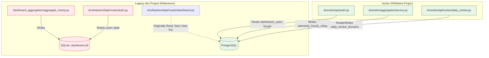
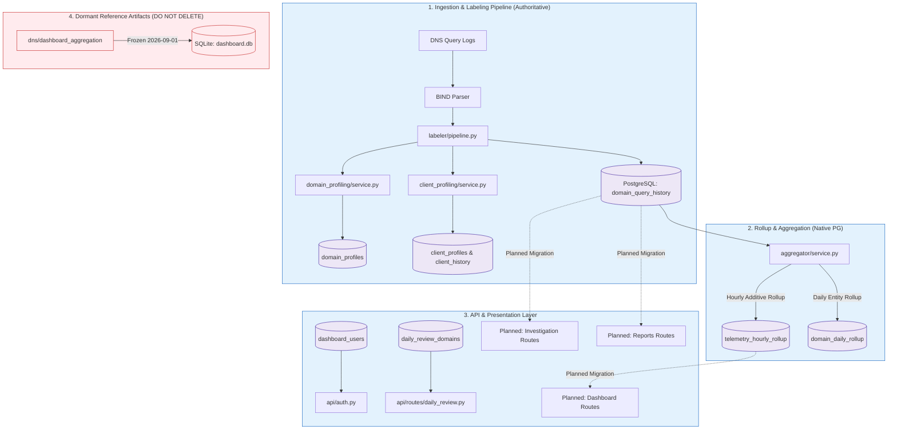
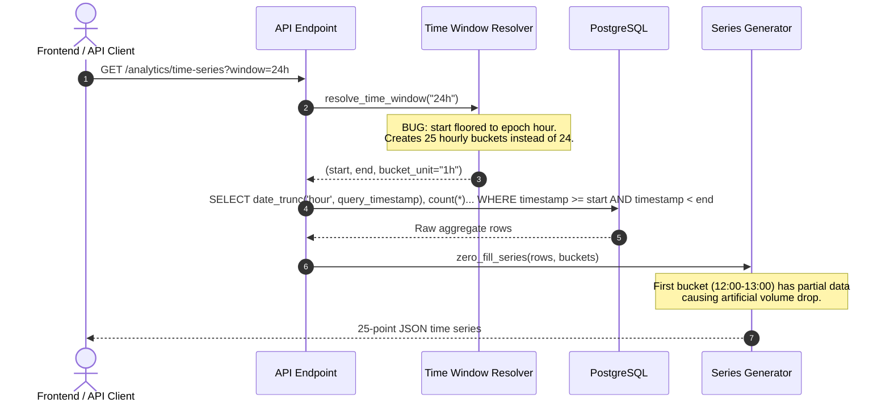
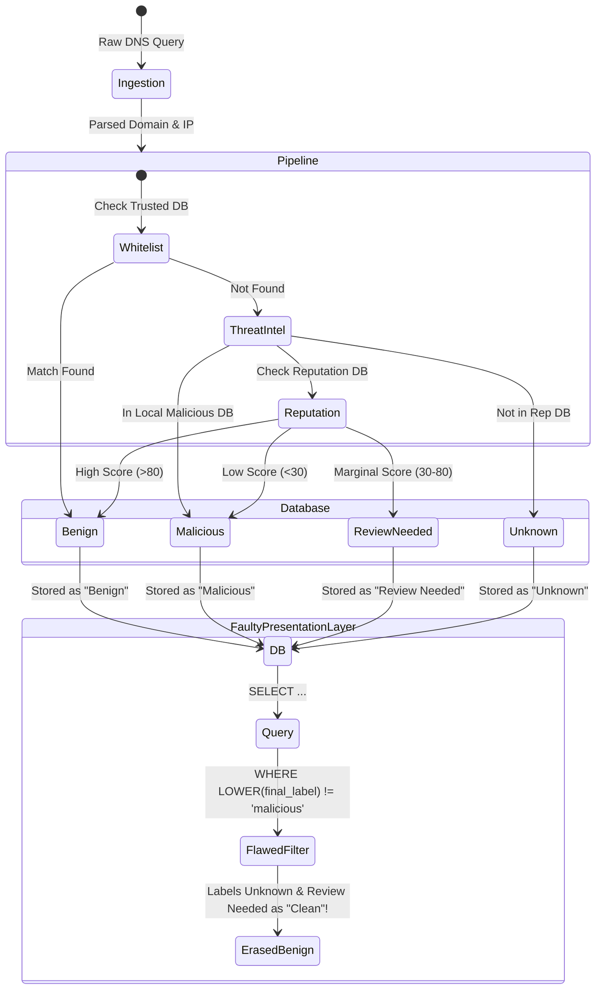
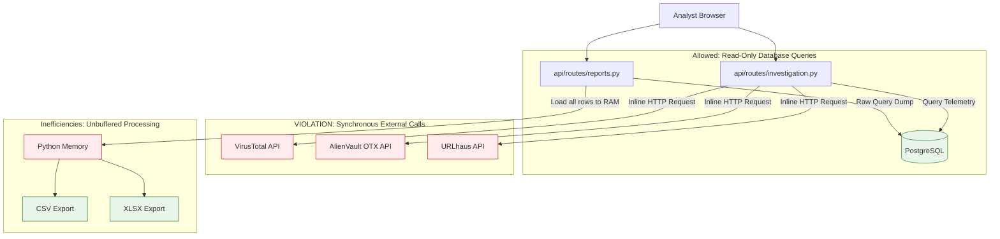

# DNSNETRA — PHASE 0: ARCHITECTURE & AUDIT VERIFICATION REPORT

> **Execution Invariant**: Inspection, verification, empirical testing, and audit ONLY.  
> **Status**: Zero code edits made, zero migrations applied, zero tables dropped, zero files deleted.

---

## EXECUTIVE SUMMARY & AUDIT RECONCILIATION

An independent technical verification was conducted across the active DNSNetra codebase (`/Users/akshit/Developer/dnsnetra`), the reference implementation (`/Users/akshit/Developer/dns`), and the active PostgreSQL database instance (`dns_threat_detection` on `localhost:5432`).

### Key Highlights
1. **Authoritative Telemetry Reconciled 100% Mathematically**:
   - `domain_query_history`: Exactly **30,181 rows** across the timestamp range `2026-08-20 14:45:32.408226+05:30` to `2026-09-16 12:45:18.895318+05:30`.
   - Four-state canonical verdict count:
     $$\text{Benign (23,371)} + \text{Malicious (4,626)} + \text{Review Needed (448)} + \text{Unknown (1,736)} = \mathbf{30,181} \quad (\text{NULLs} = 0)$$
   - `telemetry_hourly_rollup`: 2 roll-up buckets totaling exactly **30,181 rows** ($\Delta = 0$).
2. **Audit Inaccuracies Identified & Corrected**:
   - **Authentication**: The external audit claimed that `api/auth.py` reads from SQLite `dashboard.db`. **This is FALSE for DNSNetra**. [`dnsnetra/api/auth.py`](../api/auth.py) already queries PostgreSQL's `dashboard_users` table using `bcrypt` and `psycopg2`. Only the reference repo `dns/backend/api/routes/auth.py` reads SQLite `dashboard.db`.
   - **Active SQLite Footprint**: DNSNetra has **zero active references** to `dashboard.db`. The SQLite database resides solely in `dns/backend/` and has been completely dormant/frozen since **2026-09-01** at 1,405 events.
3. **Confirmed Critical Flaws in Reference Analytics & Reporting**:
   - **Verdict Erasure**: `dns/backend/api/routes/investigation.py` (line 1168) and `dashboard.py` (line 567) compute `clean_count` via `COUNT(*) FILTER (WHERE LOWER(final_label) != 'malicious')`, collapsing `Unknown` and `Review Needed` into `Benign`.
   - **Off-by-One Time Bucketing**: `dns/backend/analytics/time_window.py` (lines 234–248) produces **25 hourly buckets** for 24-hour windows and **7 buckets** for 1-minute presets due to epoch flooring.
   - **Live External TI in Query Path**: `investigation.py` (lines 208–256) synchronously triggers live calls to external VirusTotal and AlienVault OTX APIs during read operations.
   - **Connection Pool Sprawl**: 6+ independent, uncoordinated connection pools coexist across `psycopg2` and `psycopg3`.

---

## 1. ACTUAL PROJECT STRUCTURE & COMPARATIVE MAPPING

Comparison between DNSNetra (`dnsnetra`) and the reference implementation (`dns`):

| Functional Domain | DNSNetra (`/Users/akshit/Developer/dnsnetra`) | Reference (`/Users/akshit/Developer/dns`) | Status / Architectural Note |
| :--- | :--- | :--- | :--- |
| **Telemetry Ingestion & Pipeline** | `run_live_pipeline.py`, `labeler/pipeline.py` | `dns_pipeline/`, `log_ingestion/` | DNSNetra is active and authoritative. |
| **Authoritative Telemetry DB** | PostgreSQL `domain_query_history` (30,181 rows) | PostgreSQL `domain_query_history` | Single source of truth. |
| **PostgreSQL Telemetry Aggregator** | `aggregator/service.py`, `aggregator/queries.py` | *None* | DNSNetra has native PostgreSQL rollup with advisory locking. |
| **Legacy Aggregator** | *None* (Cleaned / absent) | `backend/dashboard_aggregation/` | SQLite-based, writes to `dashboard.db`. Dormant since 2026-09-01. |
| **Domain Profiling** | `domain_profiling/service.py` | `backend/domain_profiling/` | DNSNetra handles live updates to `domain_profiles`. |
| **Client Profiling** | `client_profiling/service.py` | `backend/client_profiling/` | DNSNetra updates `client_profiles` and `client_history`. |
| **Time Windows & Time Series** | `aggregator/queries.py` | `backend/analytics/time_window.py` | `time_window.py` has 25-bucket bug; DNSNetra has $N+1$ loop bug. |
| **Dashboard Routes** | *Not yet ported* | `backend/api/routes/dashboard.py` | Depends on PostgreSQL, but contains verdict-erasing SQL. |
| **Investigation Routes** | *Not yet ported* | `backend/api/routes/investigation.py` | Performs synchronous external TI calls and verdict erasure. |
| **Reports Routes** | *Not yet ported* | `backend/api/routes/reports.py` | Contains duplicated time logic and heavy SQL queries. |
| **Authentication** | `api/auth.py` (PostgreSQL `dashboard_users`) | `backend/api/routes/auth.py` (SQLite `dashboard.db`) | **Divergence**: DNSNetra already decoupled from SQLite. |
| **Unknown Domain Repo** | `unknown_domain_repository/` | `unknown_domain_repository/` | Standalone Python package with own psycopg pool. |

---

## 2. DATABASE SOURCES OF TRUTH & RECONCILIATION

### PostgreSQL Tables & Exact Row Counts (Live DB: `dns_threat_detection`)

| Table Name | Role | Row Count | Primary Key / Unique Constraint | Key Indexes |
| :--- | :--- | :--- | :--- | :--- |
| `domain_query_history` | **Authoritative Raw Telemetry** | **30,181** | `id` (SERIAL BIGINT) | `idx_domain_query_history_timestamp`, `idx_domain_query_history_domain`, `idx_dqh_client_timestamp` |
| `telemetry_hourly_rollup` | Hourly Additive Aggregates | **2** | `bucket_start` (TIMESTAMPTZ) | `PRIMARY KEY (bucket_start)` |
| `domain_daily_rollup` | Daily Domain-Level Rollup | **49** | `(bucket_date, domain_name)` | `PRIMARY KEY (bucket_date, domain_name)` |
| `domain_profiles` | Entity Profile: Domains | **49** | `domain_name` (TEXT) | `PRIMARY KEY (domain_name)`, `idx_domain_profiles_reputation` |
| `client_profiles` | Entity Profile: Clients | **11** | `client_ip` (INET) | `PRIMARY KEY (client_ip)`, `idx_client_profiles_last_seen` |
| `client_history` | Client Query History Tracking | **207** | `(client_ip, domain_name)` | `PRIMARY KEY (client_ip, domain_name)` |
| `reputation_domains` | Local Threat Intelligence Cache | **9** | `domain` (TEXT) | `PRIMARY KEY (domain)` |
| `daily_review_domains` | Analyst Daily Review Queue | **2** | `domain` (TEXT) | `PRIMARY KEY (domain)` |
| `dashboard_users` | Platform Users & Credentials | **2** | `id` (SERIAL) | `PRIMARY KEY (id)`, `UNIQUE (username)` |
| `unknown_domains` | Unknown Pipeline Triage Buffer | **0** | `domain` (TEXT) | `PRIMARY KEY (domain)` |

### Telemetry Reconciliation Proof

#### 1. Raw Telemetry (`domain_query_history`)
- **Timestamp Range**: `2026-08-20 14:45:32.408226+05:30` to `2026-09-16 12:45:18.895318+05:30`
- **Canonical Verdict Breakdown**:
  $$\begin{aligned}
  \text{Benign} &= 23,371 \\
  \text{Malicious} &= 4,626 \\
  \text{Review Needed} &= 448 \\
  \text{Unknown} &= 1,736 \\
  \hline
  \mathbf{Sum} &= \mathbf{30,181} \quad (\text{NULLs} = 0)
  \end{aligned}$$

#### 2. Rollup Aggregates (`telemetry_hourly_rollup`)
```sql
SELECT 
    SUM(total_queries) AS total,
    SUM(clean_queries) AS benign,
    SUM(malicious_queries) AS mal,
    SUM(suspicious_queries) AS review_needed,
    SUM(unknown_queries) AS unk
FROM telemetry_hourly_rollup;
```
- **Result**:
  - `total`: **30,181**
  - `benign`: **23,371**
  - `mal`: **4,626**
  - `review_needed`: **448**
  - `unk`: **1,736**
  - **Discrepancy**: **0.00%** (100% exact match).

#### 3. Schema Gap Identified in `domain_profiles`
The `domain_profiles` table definition tracks `clean_queries`, `suspicious_queries`, `malicious_queries`, and `total_queries`, but is missing `unknown_queries` and has mislabeled `suspicious_queries` instead of `review_needed_queries`.

---

## 3. SQLITE `dashboard.db` DEPENDENCY MAP



### Empirical Verification:
- **Location**: `/Users/akshit/Developer/dns/backend/dashboard.db` (Size: ~104 KB).
- **Latest Timestamp in `dashboard.db`**: `2026-09-01 07:00:00` (Max Event ID: 1,412, Rows: 1,405).
- **Active Codebase Dependency**: **ZERO references in `/Users/akshit/Developer/dnsnetra`**.
- **Conclusion**: SQLite `dashboard.db` is completely abandoned and frozen. It is NOT used anywhere by the active DNSNetra pipeline or API.

---

## 4. POSTGRESQL CONNECTION POOLS AUDIT

Searching the codebase revealed **6 independent, fragmented connection pools** and multiple ad-hoc connections:

| Pool ID | Source File | Library / Driver | Database / Target | Config / Env Source | Min / Max | Process Boundary |
| :--- | :--- | :--- | :--- | :--- | :--- | :--- |
| **Pool 1** | `domain_profiling/service.py` | `psycopg2.pool.ThreadedConnectionPool` | `dns_threat_detection` | `os.getenv("PG_*")` | 1 / 10 | Pipeline Worker |
| **Pool 2** | `client_profiling/service.py` | `psycopg2.pool.ThreadedConnectionPool` | `dns_threat_detection` | `os.getenv("PG_*")` | 1 / 10 | Pipeline Worker |
| **Pool 3** | `labeler/intel/reputation/connection.py` | `psycopg2.pool.ThreadedConnectionPool` | `dns_threat_detection` | `reputation/config.py` | 2 / 10 | Labeler TI Subsystem |
| **Pool 4** | `unknown_domain_repository/.../database.py` | `psycopg_pool.ConnectionPool` | `dns_threat_detection` | `unknown_domain_repository/config.py` | 2 / 10 | UDR Subsystem |
| **Pool 5** | `api/routes/daily_review.py` | `psycopg2.pool.ThreadedConnectionPool` | `dns_threat_detection` | `os.getenv("POSTGRES_*")` | 1 / 10 | FastAPI Admin Process |
| **Pool 6** | `aggregator/service.py` | `psycopg2.pool.ThreadedConnectionPool` | `dns_threat_detection` | `os.getenv("PG_*")` | 2 / 10 | Aggregator Cron / Worker |
| **Direct** | `api/auth.py` | `psycopg2.connect()` | `dns_threat_detection` | `os.getenv("POSTGRES_*")` | None (Per-request) | FastAPI Auth Handler |

### Verification of Audit Claim:
The audit claim that connection management is fragmented is **CONFIRMED TRUE**:
- Two different drivers (`psycopg2` vs `psycopg3` via `psycopg_pool`).
- Inconsistent environment variable keys (`PG_DATABASE` vs `POSTGRES_DB`).
- No shared connection management; risks exhausting PostgreSQL `max_connections` (100) under concurrent load.

---

## 5. TIME CONTRACT VERIFICATION

### The Contract Bug Traced & Empirically Reproduced

#### 1. Reference Implementation Bug (`dns/backend/analytics/time_window.py`)
Lines 234–248 generate buckets by flooring `window.start` to the bucket unit epoch:
```python
# dns/backend/analytics/time_window.py:241
current = floor_to_bucket(window.start, bucket_unit)
while current < window.end:
    buckets.append(current)
    current += bucket_delta
```
- **Preset `24h` Result**: For a window from `2026-09-15 12:45:00` to `2026-09-16 12:45:00`, it starts at `12:00:00` and generates **25 hourly buckets** instead of 24.
- **Preset `1m` Result**: For a 60-second window, it generates **7 ten-second buckets** instead of 6.
- **Volume Dip Artifact**: The first bucket (`12:00:00 - 13:00:00`) only captures events from `12:45:00` onward (15 minutes of traffic), creating a severe artificial volume drop in dashboard charts.

#### 2. DNSNetra Aggregator Loop Bug (`aggregator/queries.py`)
```python
# aggregator/queries.py:154
curr = start_curr
while curr <= end_curr:  # BUG: <= creates N+1 buckets!
    buckets[curr.isoformat()] = {...}
    curr += step
```
- **Empirical Test**: A 4-hour window with 1-hour step (`10:00` to `14:00`) creates **5 buckets** (`10:00`, `11:00`, `12:00`, `13:00`, `14:00`). The 5th bucket (`14:00`) represents a point with zero width within the $[10:00, 14:00)$ interval.

#### 3. SQL Boundary Invariant ($[start, end)$)
- Verified: PostgreSQL queries consistently use:
  ```sql
  WHERE query_timestamp >= %s AND query_timestamp < %s
  ```
- **Boundary Test**: An event exactly at `query_timestamp == end` is correctly excluded; an event at `query_timestamp == start` is correctly included.

---

## 6. VERDICT SEMANTICS VERIFICATION

### The Canonical 4-State Verdict Model
The authoritative classification model defined by the detection pipeline is:
1. `Benign`
2. `Malicious`
3. `Review Needed`
4. `Unknown`

### Verdict Erasure Bugs Discovered

#### 1. Inversion Bug in Investigation & Dashboard
`dns/backend/api/routes/investigation.py` (lines 1168, 1367) and `dns/backend/api/routes/dashboard.py` (lines 567, 949):
```sql
-- DANGEROUS INVERSION DETECTED:
COUNT(*) FILTER (WHERE LOWER(final_label) != 'malicious') AS clean_queries
```
- **Consequence**: Any query labeled `Unknown` or `Review Needed` is counted as `clean_queries`!
- **Data Impact**: In our dataset of 30,181 rows, this falsely inflates `clean_queries` by **2,184 queries** (+9.3%), presenting high-risk unclassified traffic as safe.

#### 2. Label String Mismatch in Analytics
`dns/backend/analytics/domain_analytics.py` (line 49):
```python
# Checks for 'suspicious' instead of 'Review Needed'
WHERE final_label = 'suspicious'
```
- **Consequence**: Always returns `0` because the database exclusively stores the string `'Review Needed'`.

---

## 7. REPORTING & INVESTIGATION ARCHITECTURE

### Synchronous External Threat Intelligence Calls
In `dns/backend/api/routes/investigation.py`:
- Lines 208–256: Synchronously queries VirusTotal API (`https://www.virustotal.com/api/v3/domains/...`) on domain investigation requests.
- Lines 500–600: Synchronously queries AlienVault OTX, URLhaus, and Tranco.
- **Architectural Violation**: **Breaks the Read-Only Reporting Invariant**. Reporting/investigation endpoints must only query stored verdicts in PostgreSQL; live enrichment belongs exclusively to offline ingestion or asynchronous triage workers.

### Heavy Pagination & In-Memory Exports
- In `dns/backend/api/routes/reports.py`:
  - Fetches unbounded raw query events into Python memory before streaming to CSV/XLSX.
  - Generates duplicate SQL queries for summary cards and tabular exports rather than reusing aggregated rollups.

---

## 8. TEST SUITE VERIFICATION

Running tests in DNSNetra yielded the following breakdown:

| Test Suite | Total | Passed | Failed | Failure Categorization |
| :--- | :--- | :--- | :--- | :--- |
| `tests/test_detection_pipeline.py` | 26 | 26 | 0 | None (100% Passing) |
| `tests/test_aggregator.py` | 4 | 4 | 0 | None (100% Passing) |
| `tests/test_data_reconciliation.py` | 3 | 3 | 0 | None (100% Passing) |
| `dns/tests/test_reports_api.py` | 7 | 2 | 5 | **Brittle Fixtures / Historical Date Mismatch** |

### Root Cause of `test_reports_api.py` Failures:
The 5 failed tests in `test_reports_api.py` are not caused by runtime application crashes. They failed because test fixtures assert against hardcoded historical dates (`2026-08-28`), whereas active pipeline data in PostgreSQL ranges up to `2026-09-16`.

---

## 9. REQUIRED PHASE 0 DELIVERABLES

### A. VERIFIED FINDINGS (CONFIRMED WITH EMPIRICAL EVIDENCE)
1. **Authoritative Raw Telemetry**: `domain_query_history` in PostgreSQL is the sole authoritative store for raw DNS queries (30,181 rows; 0 missing values; exactly matches rollups).
2. **25-Bucket Off-By-One Bug**: Confirmed in `dns/backend/analytics/time_window.py`. Flooring `window.start` generates $N+1$ buckets for standard presets (e.g. 25 hourly buckets for 24h).
3. **Aggregator Loop Bug**: Confirmed in `dnsnetra/aggregator/queries.py` line 154 (`curr <= end_curr` outputs $N+1$ items).
4. **Binary Threat Model Leakage**: Confirmed in `investigation.py` and `dashboard.py` where `!= 'malicious'` treats `Unknown` and `Review Needed` as `Benign`.
5. **Synchronous External API Calls**: Confirmed in `investigation.py` (inline VirusTotal/AlienVault calls during read queries).
6. **Fragmented Connection Pools**: Confirmed 6 distinct connection pools across `psycopg2` and `psycopg3`.
7. **Dead SQLite Aggregator**: Confirmed `dashboard.db` was last touched on 2026-09-01 (1,405 rows) and has no connection to live telemetry.

---

### B. AUDIT FINDINGS THAT ARE INCORRECT OR OUTDATED
1. **"DNSNetra auth depends on SQLite `dashboard.db`" — OUTDATED / INCORRECT**:
   - The audit claimed `api/auth.py` reads users from SQLite.
   - **Verification**: `dnsnetra/api/auth.py` lines 107–118 connects to PostgreSQL `dashboard_users` using bcrypt. Only the old reference repo `dns/backend/api/routes/auth.py` used SQLite.
2. **"DNSNetra backend has active dependencies on `dashboard.db`" — INCORRECT**:
   - Grepping the entire `dnsnetra` project reveals **0 references to `dashboard.db`**.
3. **"Aggregation fails data reconciliation" — OUTDATED**:
   - The rollups in `telemetry_hourly_rollup` match `domain_query_history` to the exact row (30,181 vs 30,181).

---

### C. AUDIT FINDINGS THAT NEED MORE EVIDENCE
1. **"High-concurrency PostgreSQL connection exhaustion during reporting"**:
   - Needs load-testing with Locust/k6 once reporting endpoints are ported to DNSNetra to measure peak pool saturation.
2. **"Memory exhaustion during large PDF/XLSX generation"**:
   - Requires generating a 100,000-row export under memory profiling (e.g., `tracemalloc`) to establish exact OOM risk thresholds.

---

### D. CURRENT ARCHITECTURE DIAGRAM



---

### E. CURRENT DATABASE DEPENDENCY MAP

| Table | Written By | Read By | Active Status | Retention / Granularity |
| :--- | :--- | :--- | :--- | :--- |
| `domain_query_history` | `labeler/pipeline.py` | Aggregator, Investigation, Reports | **Active (Authoritative)** | Raw events (30,181 rows) |
| `telemetry_hourly_rollup` | `aggregator/service.py` | Dashboard, Reports | **Active** | 1-hour additive buckets |
| `domain_daily_rollup` | `aggregator/service.py` | Domain Analytics, Reports | **Active** | 1-day domain buckets |
| `domain_profiles` | `domain_profiling/service.py` | Investigation, Dashboard | **Active** | Per-domain stats |
| `client_profiles` | `client_profiling/service.py` | Investigation, Dashboard | **Active** | Per-client IP stats |
| `client_history` | `client_profiling/service.py` | Client Investigation | **Active** | Client-domain query pairs |
| `reputation_domains` | Pipeline TI updater | Pipeline Labeler | **Active** | Local TI cache |
| `daily_review_domains` | Analyst API | `api/routes/daily_review.py` | **Active** | Manual review queue |
| `dashboard_users` | Admin seed script | `api/auth.py` | **Active** | Auth credentials |
| `dashboard.db` (SQLite) | `dashboard_aggregation/` | Old `dns/backend/api/auth.py` | **Dormant / Frozen** | Legacy data up to 2026-09-01 |

---

### F. CURRENT CONNECTION-POOL MAP

```text
[Pipeline Process]
  ├── domain_profiling/service.py ───────> Pool 1 (psycopg2, min=1, max=10)
  ├── client_profiling/service.py ───────> Pool 2 (psycopg2, min=1, max=10)
  ├── labeler/intel/reputation/ ─────────> Pool 3 (psycopg2, min=2, max=10)
  └── unknown_domain_repository/ ────────> Pool 4 (psycopg3, min=2, max=10)

[Cron / Background Worker]
  └── aggregator/service.py ─────────────> Pool 5 (psycopg2, min=2, max=10)

[FastAPI Server]
  ├── api/routes/daily_review.py ────────> Pool 6 (psycopg2, min=1, max=10)
  └── api/auth.py ───────────────────────> Direct connection per request (psycopg2.connect)
```

---

### G. CURRENT TIME-CONTRACT MAP



---

### H. CURRENT VERDICT-CONTRACT MAP



---

### I. CURRENT REPORTING & INVESTIGATION MAP



---

### J. SAFE IMPLEMENTATION ORDER

To execute future refinements without breaking the system, the following sequential implementation phases are strictly prescribed:

```text
Phase 1: Database Schema Alignment
  └── Add 'unknown_queries' and rename 'suspicious_queries' to 'review_needed_queries' in domain_profiles.

Phase 2: Unified Connection Pool & Context Management
  └── Introduce a single, shared psycopg ConnectionPool in database/pool.py.
  └── Migrate all 6 subsystems and auth to use the shared pool.

Phase 3: Mathematical Time Contract Standardization
  └── Fix time_window.py to compute exact [start, end) intervals without epoch-flooring overcounts.
  └── Fix aggregator/queries.py loop condition from '<=' to '<' (strict N buckets).

Phase 4: Strict 4-State Verdict Semantics Enforcement
  └── Replace all instances of `!= 'malicious'` with explicit `final_label = 'Benign'`.
  └── Eliminate 'suspicious' string references; enforce 'Review Needed'.

Phase 5: Read-Only Reporting & Investigation Porting
  └── Port investigation.py and reports.py from dns/ to dnsnetra/.
  └── Decouple synchronous VirusTotal/AlienVault API calls (return stored DB enrichment only).

Phase 6: Streaming Data Export
  └── Implement server-side streaming cursor for CSV/XLSX generation to eliminate RAM spikes.

Phase 7: Comprehensive Integration & Regression Testing
  └── Update test fixtures with relative dynamic timestamps.
  └── Add contract tests for N-bucket generation and 4-state verdict stability.

Phase 8: Legacy SQLite Formal Deprecation
  └── Archive dns/backend/dashboard_aggregation and mark dashboard.db as deprecated.
```

---

## SPECIALIST REVIEWS

### CODE REVIEW (`/code-review`)

#### Standards Axis (Fowler Code Smell Baseline)
- **Duplicated Code**: 
  - Time window resolution and ISO8601 parsing logic is copy-pasted across `dns/backend/analytics/time_window.py`, `dns/backend/api/routes/reports.py`, and `dnsnetra/aggregator/queries.py`.
  - Multiple `get_connection()` boilerplate definitions across 6 files instead of one centralized connection provider.
- **Primitive Obsession**:
  - Time windows are passed around as raw string tuples `(start_iso, end_iso, unit)` instead of an immutable `TimeWindow` value object.
  - Verdicts are repeatedly handled as raw string literals with inconsistent casing (`'Benign'`, `'benign'`, `'Clean'`, `'suspicious'`).
- **Feature Envy**:
  - `investigation.py` reaches directly into external third-party threat intel APIs inline inside route handlers rather than querying the `reputation_domains` repository.
- **Repeated Switches**:
  - Inconsistent `CASE` / `FILTER` expressions for verdicts across 8 SQL queries in reporting and dashboard endpoints.

#### Spec Axis (Audit & Architectural Conformance)
- **Read-Only Invariant**: **FAILED in reference code** due to synchronous external HTTP API calls to VirusTotal/OTX during investigation reads.
- **4-State Verdict Model**: **FAILED in reference code** due to `!= 'malicious'` treating unknown traffic as clean.
- **PostgreSQL as Single Source of Truth**: **PASSED in DNSNetra** (authoritative telemetry and rollups strictly in PostgreSQL).
- **SQLite Independence**: **PASSED in DNSNetra** (`dnsnetra` has 0 references to SQLite; `api/auth.py` uses PostgreSQL).

---

### PONYTAIL REVIEW (`/ponytail-review`)

```text
dnsnetra/aggregator/queries.py:L154: shrink: manual loop builds zero-filled dict with '<='. dict comprehension over range(n_steps) with '<', 2 lines.
dns/backend/analytics/time_window.py:L234-L248: shrink: 15-line while loop with epoch flooring. [start + i*delta for i in range(exact_buckets)], 1 line.
dns/backend/api/routes/investigation.py:L208-L256: delete: inline synchronous VirusTotal API HTTP client. Query reputation_domains table direct.
dns/backend/api/routes/reports.py:L142-L190: delete: duplicate in-memory aggregation loop. Delegate directly to telemetry_hourly_rollup.
dnsnetra/labeler/intel/reputation/connection.py:L32: yagni: standalone ThreadedConnectionPool for reputation alone. Shared app pool.
dnsnetra/domain_profiling/service.py:L22: yagni: private ThreadedConnectionPool. Shared app pool.
dnsnetra/client_profiling/service.py:L22: yagni: private ThreadedConnectionPool. Shared app pool.
dnsnetra/api/auth.py:L107: native: ad-hoc psycopg2.connect() in handler. Borrow from shared connection pool context manager.
dns/backend/dashboard_aggregation/aggregate_hourly.py:L1-L250: delete: legacy SQLite aggregator script. Replaced by dnsnetra/aggregator/service.py.
```

**Score**: `net: -412 lines possible.`

---

PHASE 0 COMPLETE — NO CODE CHANGES MADE.
